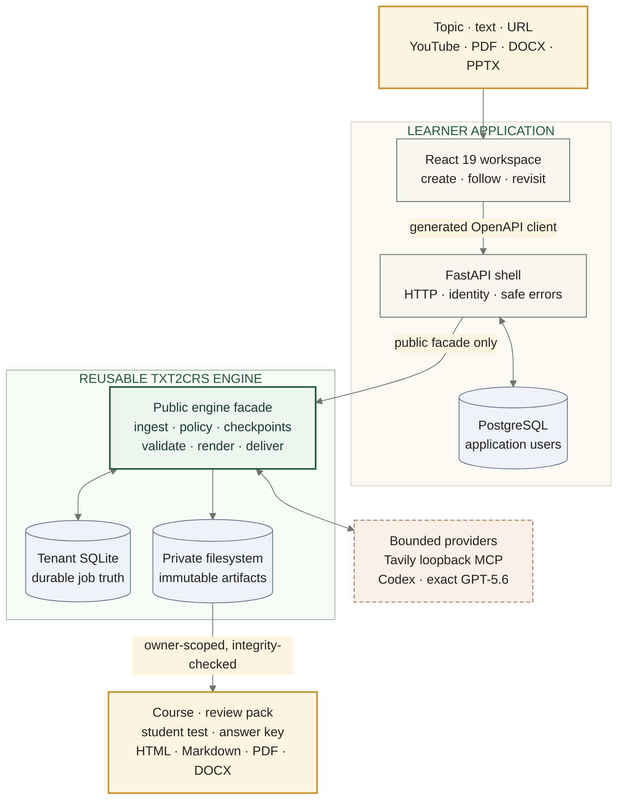

<p align="center">
  
</p>

<h1 align="center">txt2crs</h1>

<p align="center">
  <strong>One bounded source in. A complete learning package out.</strong>
</p>

<p align="center">
  <a href="https://github.com/moshehbenavraham/txt2crs/actions/workflows/test-backend.yml"></a>
  <a href="https://github.com/moshehbenavraham/txt2crs/actions/workflows/test-docker-compose.yml"></a>
  <a href="https://github.com/moshehbenavraham/txt2crs/actions/workflows/security.yml"></a>
  <a href="https://github.com/moshehbenavraham/txt2crs/releases/tag/v1.2.5"></a>
</p>

<p align="center">
  
  
  
  
  
  
  
  
</p>

<p align="center">
  <a href="#quick-start">Quick start</a> ·
  <a href="#architecture">Architecture</a> ·
  <a href="#try-the-deterministic-sample">Deterministic sample</a> ·
  <a href="#testing">Testing</a> ·
  <a href="#privacy-and-current-limits">Privacy &amp; limits</a>
</p>

Give txt2crs a topic, pasted text, public URL, YouTube URL, PDF, DOCX, or
PPTX. It turns that single bounded source into a source-grounded course, review
pack, student assessment, and separate instructor answer key.

Built for the OpenAI Build Week Education category, txt2crs combines a
reusable Python generation engine, a durable FastAPI application, and a warm,
focused React learner experience. The tested release runs locally through
Docker Compose; it is not presented as a hosted public generation service.

## What It Does

An authenticated learner can submit:

- a topic prompt or pasted text;
- a public URL or YouTube URL; or
- one bounded PDF, DOCX, or PPTX upload.

The application then:

1. validates and durably accepts the exact request before returning `202`;
2. ingests and policy-checks the source before provider work;
3. performs bounded Tavily research through a package-owned loopback MCP
   boundary;
4. runs exact `gpt-5.6-sol` course generation with no older-model fallback;
5. validates and checkpoints the generated learning structure;
6. renders four publications in HTML, Markdown, PDF, and DOCX; and
7. exposes exactly sixteen owner-private, integrity-checked artifacts.

| Publication | What the learner gets |
|---|---|
| **Course** | A structured curriculum with objectives, modules, lessons, and cited sources |
| **Review pack** | Key ideas, examples, study guidance, and focused practice |
| **Student assessment** | A complete test aligned to what the course actually teaches |
| **Instructor answer key** | Correct responses, explanations, and grading guidance kept separate from the student copy |

Every publication ships in **HTML, Markdown, PDF, and DOCX**: four useful
documents in four portable formats, for sixteen private artifacts in total.

Progress survives refreshes and process replacement. Results include bounded
source summaries and conflict disclosures, while the learner-facing API never
returns prompts, evidence excerpts, provider payloads, token data, checkpoint
JSON, artifact paths, or unrestricted file links.

The persistent owner-scoped course library lists retained work newest first,
uses opaque pagination, and reopens every active or completed request on its
existing durable job URL. The intake page also reads authoritative rolling
admission capacity before enabling another paid generation.

## Why It Exists

Two days after I joined OpenAI Build Week, my Zimbabwean wife asked me:
"How can we bring AI to Africa?"

That question brought me back to an IBM AI Developer certification project: a
Make.com workflow that expanded learning material, created study guides, and
generated review questions. txt2crs turns that early experiment into a
durable product boundary for learners and instructors who need structured,
reviewable education material from almost any bounded source.

## Try The Deterministic Sample

The stable judge sample uses this synthetic request:

| Field | Value |
|-------|-------|
| Topic | Teach Python variables. |
| Learning goal | Explain and use Python variables. |
| Audience | Adult learner |
| Depth | Introductory |
| Duration | 60 minutes |
| Assessment items | 1 |

This credential-free fast gate runs without network access or provider
credentials through the public deterministic application factory. The
scenario exercises real durable request, checkpoint, validation, rendering,
and artifact stores, then proves four publications and sixteen private
artifacts.

Run the engine lifecycle:

```bash
cd backend/packages/txt2crs
uv run --package txt2crs pytest \
  tests/integration/test_application_lifecycle.py -q
```

Run the same journey through the real FastAPI and React boundary:

```bash
cd frontend
TXT2CRS_BROWSER_SCENARIO=complete npx playwright test \
  --config=playwright.jobs.config.ts \
  --project=chromium
```

See the complete
[deterministic sample contract](docs/release/DETERMINISTIC_SAMPLE_1_0_0.md)
and the separately identified
[live artifact inspection](docs/release/ARTIFACT_INSPECTION_1_0_0.md).

## Quick Start

### Prerequisites

- Docker Engine with Compose
- Git and Bash (Git Bash is sufficient on Windows)
- A ChatGPT subscription identity for live Codex generation
- A Tavily API key for live research

Python, Node.js, uv, and npm are needed only for host-side development or
focused validation.

### 1. Configure local secrets

```bash
cp .env.example .env
```

Replace `SECRET_KEY`, `POSTGRES_PASSWORD`, and
`FIRST_SUPERUSER_PASSWORD` with independent values. Add the Tavily secret to
`TAVILY_API_KEY`. Keep exact model selection at:

```dotenv
TXT2CRS_MODEL_ID=gpt-5.6-sol
```

Do not commit `.env`. The example intentionally disables public signup for
the shared judge/demo profile.

### 2. Start the complete application

```bash
./scripts/start-local.sh
```

The startup assistant validates `.env`, Docker, Compose, and local port
availability, then starts PostgreSQL first and verifies the configured password
over the same authenticated network path used by the backend. If a preserved
local volume still has an older password, the assistant updates that role in
place without deleting records or printing the secret. It then runs the
authoritative `docker compose up --detach --build --wait` deployment, excluding
the explicit test-only Playwright profile. It waits for declared health checks,
prints bounded diagnostics on failure, and shows the exact application and
setup URLs on success. It is safe to run repeatedly and never deletes named
volumes or globally prunes Docker state.

Open:

- Learner application: <http://localhost:5195>
- Backend API: <http://localhost:8016>
- Superuser setup: <http://localhost:5195/setup>

### 3. Connect the ChatGPT subscription

The packaged Codex runtime uses a ChatGPT subscription identity, not API-key
authentication. Sign in with `FIRST_SUPERUSER` and
`FIRST_SUPERUSER_PASSWORD`, open the superuser setup page, and start its
ChatGPT device login. Open the displayed verification URL, enter the one-time
code, and complete the account flow. The setup page must then report
authentication, exact model, research, storage, and worker readiness before
accepting a live course.

For host-only development, the short recovery helper runs the same packaged
device flow and stores credentials under the ignored
`.txt2crs-system/` directory:

```bash
./scripts/auth-codex.sh --no-browser
```

That host directory is separate from Docker's `txt2crs-state` volume. Use the
setup page for the Docker Compose application.

Stop containers while preserving PostgreSQL and private engine-state volumes:

```bash
./scripts/start-local.sh --stop
```

The authoritative detailed paths are
[onboarding](docs/onboarding.md), [configuration](docs/CONFIGURATION.md), and
the [local deployment policy](docs/deployment-policy.md).

## Architecture

The shell is intentionally thin: it owns HTTP, identity, lifecycle, and safe
errors, while every course-generation responsibility stays behind the public
`txt2crs` package facade.



PostgreSQL owns application users. Tenant-scoped SQLite is the only
generation-job source of truth, and the private filesystem owns immutable
artifacts. One non-root FastAPI process owns one serial generation worker.
This topology prevents duplicate runtime ownership until a real external
queue exists.

The shell never reimplements generation, research, validation, persistence,
or rendering. Routes call the public engine facade and translate typed engine
errors into bounded RFC 9457 responses.

Read the full [architecture guide](docs/ARCHITECTURE.md) and
[workspace boundary](docs/TXT2CRS_FOLDER_ARCHITECTURE.md).

## How Codex And GPT-5.6 Are Used

Codex helped build and validate the project across the engine, FastAPI shell,
React application, tests, release tooling, documentation, and production
Docker path. Specification-driven sessions kept architectural decisions,
tests-first implementation, code review, security checks, and validation
evidence tied to exact repository changes.

The shipped application uses GPT-5.6 differently: the package-owned runtime
discovers and selects an exact reviewed model. The default is
`gpt-5.6-sol`; `gpt-5.6-terra` and `gpt-5.6-luna` are the other accepted exact
identifiers. Bare `gpt-5.6` is a family label, not a selectable runtime model.
Readiness and execution fail closed instead of silently choosing an older or
first-available model.

Tavily supplies bounded web research through a two-tool MCP server on
loopback. The engine owns both provider lifecycles, closes every listener and
temporary resource, checkpoints accepted work, and requires explicit provider
processing consent before transfer.

The `1.0.0` live proof used synthetic, nonpersonal input with exact
`gpt-5.6-sol` and real Tavily research. It completed with six sources, nine
durable checkpoints, four publications, and sixteen inspected artifacts. Its
historical source revision remains explicit in the
[release evidence index](docs/release/README_release.md).

## Testing

The fast credential-free repository gate is:

```bash
./scripts/validate-changes.sh
```

Package-specific commands:

```bash
# Backend shell
cd backend
POSTGRES_DB=app_test uv run pytest tests/ -v  # pre-provisioned test DB only
uv run ruff check app
uv run mypy app

# Reusable engine
cd backend/packages/txt2crs
uv run --package txt2crs pytest
uv run --package txt2crs ruff check .
uv run --package txt2crs mypy

# Frontend
cd frontend
npm run test:unit
npm run lint
npm run typecheck
npm run build
```

The validated release also covers migrated PostgreSQL acceptance tests,
deterministic Playwright journeys, fixed engine evaluations, Python
distributions, production images, non-root ownership, health checks, and
persistent container replacement. The one live provider proof is explicit
and separate from default credential-free validation.

See [development and validation](docs/development.md) and the bounded
[release evidence](docs/release/README_release.md).

## Privacy And Current Limits

The public API uses owner-scoped allowlists. Wrong-owner and missing artifact
reads are indistinguishable, downloads are integrity-checked and private,
HTML preview is parsed inertly inside an empty sandbox, and normal logs exclude
source content, prompts, provider payloads, artifact bytes, paths, tokens, and
email addresses.

The current release is suitable for a synthetic local demonstration, not
public personal-data processing. Formal legal-basis, provider-transfer,
retention, log-erasure, backup-erasure, and provider-copy records are not
complete. The demo and tracked evidence therefore use synthetic nonpersonal
content and make no GDPR-compliance claim.

Current product limits:

- local Docker Compose is the only deployment target;
- exactly one backend process and one serial generation worker are supported;
- one upload is limited to 20 MiB and normalized input to 200,000 characters;
- PDF input is limited to 200 pages and a complete bundle to 100 MiB;
- public signup is disabled in the shared judge/demo configuration;
- there is no hosted service, LMS export, collaborative editing, automatic
  grading, public artifact sharing, or concurrent worker pool; and
- GitHub Actions billing currently prevents remote CodeQL from starting,
  while every locally executable workflow equivalent passes.

See [security](docs/SECURITY.md), [deployment scope](docs/deployment-policy.md),
and [configuration](docs/CONFIGURATION.md). The complete collision-free host
listener inventory is in [port allocations](docs/PORTS.md).

## Repository Layout

```text
txt2crs/
|-- backend/
|   |-- app/                    # FastAPI application shell
|   |-- packages/txt2crs/       # Reusable education engine
|   `-- tests/                  # Shell and acceptance tests
|-- frontend/                   # React learner and operator application
|-- scripts/                    # Development and validation commands
|-- docs/
|   |-- release/                # Bounded release proof
|   `-- submission/             # Judge and Devpost evidence
|-- docker-compose.yml
|-- VERSION
`-- README.md
```

Package references:

- [Backend shell](backend/README_backend.md)
- [Reusable txt2crs engine](backend/packages/txt2crs/README_txt2crs.md)
- [Frontend](frontend/README_frontend.md)
- [Documentation index](docs/README_docs.md)

## License And Release

The repository has explicit scoped licensing in [LICENSE](LICENSE). Original
repository material outside the engine is MIT-0, identified boilerplate
material retains its stated 0BSD or MIT provenance, and the independently
installable engine retains its own scoped
[MIT-0 and Hermes-derived MIT terms](backend/packages/txt2crs/LICENSE).

The current synchronized release version is `1.2.5`. The exact public
judge-facing source is preserved by the annotated `v1.2.5` tag after the
release passed the existing distribution, production-image, health,
replacement, and privacy checks.

The complete public-safe judge package is indexed in
[submission evidence](docs/submission/README_submission.md). The remaining
YouTube and Devpost actions follow the
[human publishing handoff](docs/submission/HUMAN_PUBLISHING_HANDOFF.md).
