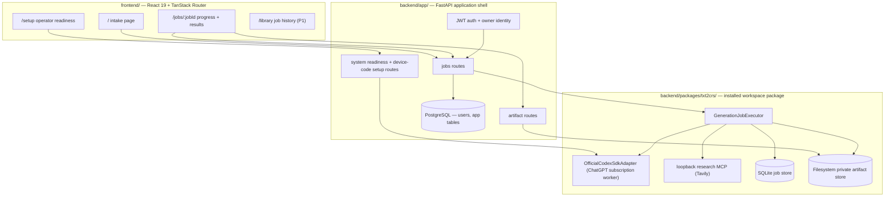
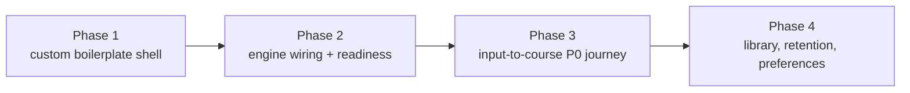

# Input-to-Course System Plan

> **Status:** Proposed
> **Created:** 2026-07-18
> **Owner:** txt2crs project

This plan describes how to build the **input-to-course system**: a full-stack
web application where a learner submits an input (topic, text, URL, file, or
media), the txt2crs engine researches and generates a complete set of learning
artifacts, and the learner receives them privately in the browser.

The plan composes three existing assets:

1. **Application shell** — a custom, trimmed form of the local
   [`python-react-boilerplate`](/home/aiwithapex/projects/python-react-boilerplate/)
   (FastAPI + React 19 + PostgreSQL + Docker Compose).
2. **Intelligence engine** — the installable
   [`txt2crs` package](../backend/packages/txt2crs/README_txt2crs.md), which
   already owns ingestion, research, staged generation, validation, rendering,
   durable jobs, safety, and private delivery.
3. **Workflow shape** — the legacy Make.com "Text to Course" automation
   reconstructed in [`make-scenarios/`](../make-scenarios/README_make.md),
   used as product inspiration, not as an implementation to clone.

Related adopted decisions this plan builds on:

- [txt2crs folder architecture](TXT2CRS_FOLDER_ARCHITECTURE.md) — the
  library-first workspace and the boilerplate integration points.
- [Feature and submission plan](../make-scenarios/FEATURE_AND_SUBMISSION_PLAN.md)
  — the P0/P1/P2 feature decisions this plan sequences into build phases.
- [Legacy system reference](../make-scenarios/LEGACY_SYSTEM_REFERENCE.md) and
  [generation pipeline](../make-scenarios/GENERATION_PIPELINE.md) — evidence
  for what the old system did and what must not be reproduced.

## Product summary

The legacy Make.com system proved the product loop: *easy input in, tangible
course out, delivered personally.* Its middle was fragile — four unchecked
model calls, public Drive links, no job state, no research, and a combined
quiz/answer document.

The new system keeps the loop and replaces the middle:

```text
learner input (text | URL | file | media)
  -> authenticated intake with consent and validation
  -> durable generation job (txt2crs engine)
       research -> evidence -> plan -> modules -> course
       -> review pack -> assessment blueprint
       -> student assessment + separate instructor answer key
  -> deterministic rendering (HTML, Markdown, PDF, DOCX)
  -> private owner-scoped results workspace
  -> idempotent completion email
```

One input produces four aligned deliverables: **Course**, **Review Pack**,
**Student Assessment**, and **Instructor Answer Key**, each downloadable in
four formats (16 private artifacts).

The browser experience is itself a deliverable. The product is judged on
what it feels like to watch an AI research, plan, and build a course — not
only on the artifacts it produces. Visual experience requirements are
first-class P0 scope in Phase 3.

## Architecture



Boundary rules (from the adopted folder architecture):

- Route handlers compose txt2crs services; they never duplicate generation,
  research, validation, persistence, or rendering logic.
- The engine never imports `backend/app/`; the app composition root selects
  concrete adapters and supplies the authenticated `user_id`.
- PostgreSQL owns application identity and app tables; the engine keeps its
  own tenant-scoped SQLite job store and filesystem artifact store as already
  implemented and tested.
- The boilerplate's administrative MCP server and the txt2crs research MCP
  remain separate security boundaries.

## Legacy scenario mapping

| Legacy Make.com element | Input-to-course replacement |
|---|---|
| Paperform form + webhook | React intake page posting to `POST /api/v1/jobs` |
| Scenario 1 (Submission row) | Validated request + immutable normalized input snapshot |
| Scenario 2 (email lookup, Onboarding row) | Authenticated user account; owner-scoped job history |
| Unsigned `clientID` handoffs | Versioned owner-scoped job IDs with idempotency keys |
| Scenario 3 (4 serial model calls) | Engine's staged, schema-constrained, checkpointed pipeline |
| Model-generated file name | Deterministic safe slugs in the application |
| Model-generated HTML → PDF service | Deterministic engine renderers (HTML/MD/PDF/DOCX) |
| Google Drive folder + anyone-with-link | Private artifact store + owner-checked download routes |
| Combined quiz/answer Google Doc | Separate student assessment and instructor answer key |
| Airtable Courses row | Durable job record + artifact manifest |
| Gmail "Your Course is Ready" | Results page plus a required idempotent completion email |
| Two Break retry handlers | Engine-wide finite transient retries + resume from checkpoint |

Rejected legacy behavior (do not reproduce): public share links by default,
email-as-identity, mutable "last input" generation source, second generative
copy of the course as HTML, commerce fields influencing nothing, and success
defined as "the email sent."

## Phase 1 — adopt a custom form of the boilerplate

Goal: the repository runs the boilerplate stack (auth, users, Docker,
generated client) with the txt2crs package installed as a workspace
dependency. The demo `items` feature is kept temporarily as a working donor
for the jobs domain and deleted once replaced (end of Phase 3).

Steps (following the integration section of
[TXT2CRS_FOLDER_ARCHITECTURE.md](TXT2CRS_FOLDER_ARCHITECTURE.md)):

1. Merge the boilerplate's backend project metadata into
   `backend/pyproject.toml`, retaining `[tool.uv.workspace]`, and declare
   `txt2crs` as a workspace dependency of the application.
2. Copy the boilerplate's FastAPI code under `backend/app/` (`api/`, `core/`,
   `schemas/`, `services/`, `models.py`, `crud.py`, `alembic/`).
3. Add the React application under repository-root `frontend/`.
4. Copy Docker Compose files, backend/frontend Dockerfiles, and
   `.env.example`; update the backend Dockerfile to copy `packages/` before
   workspace installation.
5. Trim to the custom form:
   - **Keep:** JWT auth (login, signup, password recovery), user management,
     structured logging, RFC 9457 errors, OpenTelemetry wiring, generated
     OpenAPI client flow, Zod schemas, shadcn/ui components, validation
     scripts, Playwright setup.
   - **Morph, then remove:** keep the `items` demo domain alive as the donor
     for the jobs domain. In Phase 3, copy and rename the pieces whose shape
     matches (owner-scoped list/detail routes, SQLModel/crud/schema pattern
     and tests, frontend list/pagination/delete pages and client wiring);
     write fresh what has no items equivalent (job submission with
     idempotency and admission, the progress state machine, artifact
     routes); drop what does not apply (PUT/edit flows). Delete all
     remaining `items` code once the jobs domain replaces it.
   - **Decide per-file:** the boilerplate's admin MCP server (keep only if it
     stays read-only and clearly separated from the research MCP); email
     templates (keep — required for the P0 completion email);
     examples/context-profile tooling (optional).
6. Reconcile tooling with the engine package: one ruff/mypy configuration
   strategy for the workspace, Python version alignment
   (boilerplate targets 3.14; the engine already type-checks on 3.14), and
   `scripts/validate-changes.sh` extended to run the package suite.
7. Verify: `docker compose up -d` serves login/signup against PostgreSQL;
   `uv run --package txt2crs pytest` still passes unchanged; Alembic
   migrations run in `prestart`.

Exit criteria: a clean stack with working auth, the engine importable from
`backend/app/`, and CI-style validation green (the `items` donor still
present and passing its own tests).

## Phase 2 — wire the engine (composition root and system readiness)

Goal: the application can construct the engine, report readiness, and
complete the dedicated ChatGPT device-code setup from the browser.

1. Build one composition root in `backend/app/` that constructs, per the
   package's application-assembly rules: admission limits, `RunBudget`,
   reviewed `SourcePolicyRegistry`, `ResearchToolService`, loopback
   `ResearchMcpApplication`, `OfficialCodexSdkAdapter` (explicit isolated
   `CODEX_HOME`), ingestion service, course pipeline, `SqliteJobStore`,
   `FilesystemPrivateArtifactStore`, and one `GenerationJobExecutor` worker.
2. Add settings for engine paths and limits (state directory, artifact root,
   Tavily configuration, per-user and global admission caps, retention).
3. Implement system routes that call the framework-independent
   `DedicatedSystemAuthenticator` (replacing the temporary
   `txt2crs-system-auth` console flow):
   - `GET  /api/v1/system/readiness` — safe provider/storage/research
     readiness; never exposes tokens.
   - `POST /api/v1/system/auth/start` — superuser-only device-code start.
   - `GET  /api/v1/system/auth/status` — browser-safe polling state.
4. Build the operator `/setup` page: connection status, verification URL and
   short code ceremony, readiness summary, and a clear refuse-new-work state.
5. Run the engine executor as one bounded in-process background worker
   (no new queue platform), with startup recovery of interrupted jobs from
   checkpoints.

Exit criteria: readiness endpoint truthfully reports a configured or
unconfigured system; an operator can complete device-code setup entirely in
the browser; submission is refused with a clear reason when not ready.

## Phase 3 — the input-to-course workflow (P0 core)

Goal: the complete learner journey — submit, watch, receive — works end to
end against the real engine.

### API surface

| Method/path | Responsibility |
|---|---|
| `POST /api/v1/jobs` | Validate input, establish owner + idempotency key, collect consent/`learner_age` context, reserve finite admission, snapshot input immutably, start generation |
| `GET  /api/v1/jobs/{job_id}` | Owner-scoped status with public-safe progress projection |
| `GET  /api/v1/jobs/{job_id}/artifacts` | Completed artifact manifest grouped by deliverable |
| `GET  /api/v1/jobs/{job_id}/artifacts/{artifact_id}` | Owner-checked preview/download |
| `POST /api/v1/jobs/{job_id}/cancel` | Owner-scoped cancellation (P1) |
| `DELETE /api/v1/jobs/{job_id}` | Owner deletion of job and artifacts (P1) |

Contract rules: strict Pydantic request models (`extra="forbid"`), RFC 9457
errors, no raw provider events, prompts, credentials, or filesystem paths in
any response.

### Frontend routes

| Route | Experience |
|---|---|
| `/` | Product story, the four deliverables, input form (text, URL, upload), optional level (`Auto` + beginner/intermediate/advanced/mixed), audience/goals, required consent, sample input |
| `/jobs/:jobId` | Refresh-safe live progress over the real job states (accepted, researching, drafting, validating, rendering, delivering, completed/failed/cancelled), transitioning into results |
| `/jobs/:jobId` results | Four deliverable cards; HTML preview; HTML/MD/PDF/DOCX downloads per card; sources/citations and unresolved-conflict disclosure; clearly separated instructor material |
| `/setup` | Operator readiness (Phase 2) |

### Visual experience (P0)

The interface is not a wrapper around the API; it is the product's stage.
The core story — one input becomes four aligned learning deliverables —
must be *felt* in the browser and must read instantly in a
sub-three-minute screen recording.

- **A distinctive visual identity.** Deliberate typography, palette, and
  composition designed for this product; no default shadcn/boilerplate
  dashboard look on any learner-facing page.
- **The landing page sells the transformation in one screen.** The input
  and the four promised deliverables are both visible; a visitor
  understands the product without reading documentation.
- **Generation is theater.** The progress page is a living view of the
  real pipeline — research underway, sources found, the plan taking
  shape, modules drafting, validation, rendering — with motion and
  plain-language narration. Never a bare spinner or percent bar.
- **Results are a reveal.** The four deliverable cards arrive as a
  moment; in-browser previews look like finished publications, not raw
  rendered HTML dumps.
- **Motion is purposeful.** Stage transitions, arriving artifacts, and
  state changes animate smoothly; nothing functional ever blocks on an
  animation.
- **Every state is designed** — empty, queued, validating, failed,
  review-required, cancelled — so a live demo can never land on an
  unstyled screen.

All animation and narration must project only public-safe progress events;
the theater never leaks prompts, provider events, or private research text.

### Workflow behaviors carried from the feature plan (all P0)

- Input preview and extraction warnings shown before/while generating.
- Duplicate submission with the same idempotency key never creates two jobs.
- Research always precedes drafting; sources appear in results.
- Failure, review-required, and cancelled states are safe and actionable.
- Crash resume from engine checkpoints after an application restart.
- Finite demo spend limits enforced through admission reservations.
- Responsive layout and keyboard operability.
- **Idempotent completion email** — the engine's notification interface wired
  to SMTP using the boilerplate's email templates; links to the results page,
  never to public files; sent only after committed delivery; duplicate-safe on
  retry and replay. The results page remains the primary delivery surface, and
  a failed email send never marks the job failed.

Exit criteria: the acceptance checklist in the
[feature plan](../make-scenarios/FEATURE_AND_SUBMISSION_PLAN.md) P0 section
passes, driven by automated acceptance tests plus one live representative
course exercised end to end, and the `items` donor domain is fully deleted
(backend and frontend) now that the jobs domain has replaced it. The
learner-facing experience additionally passes a screen-recording review:
the full submit → progress → reveal journey looks deliberate and
impressive at desktop and mobile widths with no unstyled state visible.

## Phase 4 — delivery polish (P1, in order)

1. **Library/history** — `/library` listing of the owner's jobs with status,
   reopen, and delete; the durable-job replacement for the legacy "returning
   customer" Onboarding row.
2. **Cancellation and deletion/retention** — cancel action, owner deletion,
   and a visible retention notice backed by the engine's purge support.
3. **Language/RTL selector, duration/depth control, accessibility
   preferences** — expose contracts the engine already supports.
4. **Operator observability** — safe diagnostics from private event
   contracts; pre-demo evaluation runs from the fixed corpus.

## Testing strategy

| Layer | Location | Content |
|---|---|---|
| Engine | `backend/packages/txt2crs/tests/` | Existing suite; remains credential-free and unchanged by this plan |
| Application acceptance | `backend/tests/acceptance/` | Written first per phase: auth + ownership, readiness, full job lifecycle against deterministic engine fakes, artifact authorization, idempotency, resume |
| API unit | `backend/tests/` | Route validation, error contracts, composition-root configuration |
| Frontend e2e | `frontend/tests/` | Playwright: intake validation, progress refresh, results downloads, setup ceremony |
| Live | gated | One representative end-to-end course behind the existing `TXT2CRS_RUN_LIVE_CODEX=1` style gate |

The engine's deterministic fake runtime (already used by
`tests/integration/test_generation_job_executor.py`) is the default backend
for application tests; live provider access is never required for CI.

## Risks and open decisions

| Risk/decision | Position |
|---|---|
| Two persistence stores (PostgreSQL + engine SQLite) | Accepted for now; the engine's store is implemented, tested, and tenant-scoped. Revisit only if operational pain appears. |
| In-process worker vs. queue platform | One bounded in-process executor first; the durable job store makes a later extraction safe. |
| Boilerplate drift | Pull the boilerplate once as a snapshot; record the source version in the merge commit. Do not track upstream continuously during the build. |
| Dedicated ChatGPT identity | Remains a single operator-controlled demo identity; multi-tenant pooling of a personal subscription stays prohibited. |
| Admin MCP server exposure | Keep disabled by default in deployment; enable only for local development. |
| Commerce (service/payment/coupon) | Deferred entirely, matching the feature plan. |

## Sequence summary



Each phase ends with its acceptance tests green, the full workspace
validation passing, and a working demo of that phase's exit criteria before
the next phase begins.
