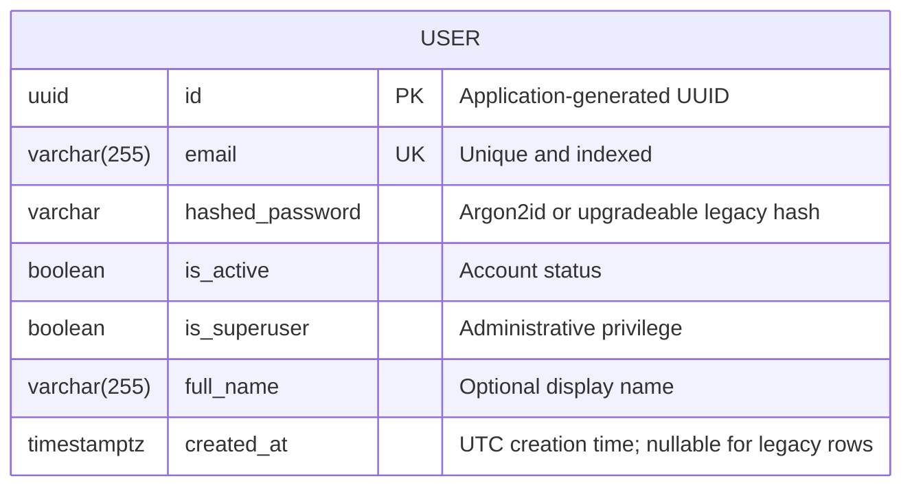

# Database Schema

The application deliberately uses two persistence boundaries:

- PostgreSQL stores shell-owned user identity and authentication data.
- Tenant-scoped SQLite under the private txt2crs state directory stores
  engine-owned course jobs, checkpoints, lifecycle events, and artifact
  metadata.

The FastAPI shell accesses course state only through the public `txt2crs`
application facade. Engine tables are not SQLModel application tables and are
documented by the reusable package.

## PostgreSQL Entity Diagram



## Current PostgreSQL Tables

### User

The quoted PostgreSQL table `"user"` stores application accounts and
authentication state.

| Column | Type | Constraints | Description |
|--------|------|-------------|-------------|
| `id` | UUID | PRIMARY KEY, NOT NULL | Application-generated account identifier |
| `email` | VARCHAR(255) | UNIQUE, NOT NULL, INDEX | Validated login email |
| `hashed_password` | VARCHAR | NOT NULL | Password hash; never plaintext |
| `is_active` | BOOLEAN | NOT NULL | Whether login is allowed; application default true |
| `is_superuser` | BOOLEAN | NOT NULL | Administrator access; application default false |
| `full_name` | VARCHAR(255) | NULL | Optional display name |
| `created_at` | TIMESTAMPTZ | NULL | UTC creation time; nullable for migrated rows |

The `ix_user_email` B-tree index supports login and administrative lookup.
The database uniqueness constraint is the final protection against duplicate
emails.

## Owner-State Erasure

User deletion spans both persistence boundaries and therefore follows a fixed
order:

1. Authorize the requester and resolve the target PostgreSQL user.
2. Call `Txt2CrsApplication.purge_owner(user_id=target_user_id)`.
3. The engine cancels and joins matching active execution, removes private
   artifacts, and transactionally removes that owner's SQLite job state.
4. Only after purge succeeds, delete and commit the PostgreSQL user.

An engine purge failure returns `USER_2007` and leaves the PostgreSQL row
unchanged for retry. If PostgreSQL fails after a successful purge, the API
reports that database failure truthfully; repeating the idempotent engine
purge is safe before retrying the user delete.

## Alembic History

The current head is `a7d9c2e4f601`. Its upgrade removes the retired scaffold
content table after durable course jobs replace that domain.

Its downgrade recreates the complete previous table shape, foreign key,
primary key, and owner index so the preceding application revision can start.
The downgrade is schema-only: rows intentionally removed by the upgrade
cannot be reconstructed. Operators must not interpret a successful downgrade
as data recovery.

Historical migration files remain immutable even when they mention retired
schema. New PostgreSQL changes require a new reviewed Alembic revision:

```bash
cd backend
uv run alembic revision --autogenerate -m "describe the schema change"
uv run alembic upgrade head
uv run alembic check
```

Always inspect autogenerated operations and verify upgrade, one-revision
downgrade, and re-upgrade against disposable PostgreSQL before release.

## Common User Queries

### Get a User by Email

```python
statement = select(User).where(User.email == email)
user = session.exec(statement).first()
```

### Count Active Users

```python
statement = (
    select(func.count())
    .select_from(User)
    .where(User.is_active == True)  # noqa: E712
)
active_user_count = session.exec(statement).one()
```

SQLModel and SQLAlchemy parameterize values; never build SQL from untrusted
strings.

## Security Notes

1. Hash passwords through the shared security helper; never persist plaintext.
2. Keep user-not-found authentication responses non-enumerating.
3. Treat `is_superuser` as a privileged field unavailable to self-service
   profile updates.
4. Keep the engine SQLite database and artifact tree private to UID/GID 1001.
5. Never query or mutate engine persistence directly from FastAPI routes.
6. Run owner purge before PostgreSQL deletion; database cascades cannot erase
   the separate engine store or private artifact files.
