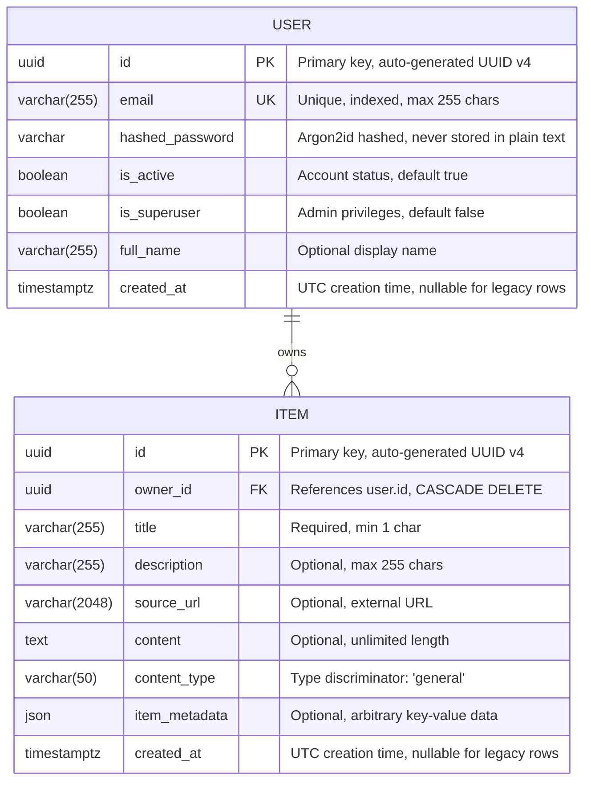

# Database Schema Documentation

> Entity-Relationship Diagram and schema documentation for the Python React Boilerplate

## Entity-Relationship Diagram



## Tables

### User Table

Stores user accounts and authentication information.

| Column | Type | Constraints | Description |
|--------|------|-------------|-------------|
| `id` | UUID | PRIMARY KEY, DEFAULT uuid4() | Unique identifier |
| `email` | VARCHAR(255) | UNIQUE, NOT NULL, INDEX | User's email address |
| `hashed_password` | VARCHAR | NOT NULL | Argon2id hash; legacy Bcrypt hashes upgrade on login |
| `is_active` | BOOLEAN | DEFAULT TRUE | Whether account is active |
| `is_superuser` | BOOLEAN | DEFAULT FALSE | Admin privileges flag |
| `full_name` | VARCHAR(255) | NULL | User's display name |
| `created_at` | TIMESTAMPTZ | NULL | UTC creation timestamp; nullable for legacy rows |

**Indexes:**
- `ix_user_email` - B-tree index on `email` for fast lookups

**Notes:**
- Password is hashed using Argon2id before storage
- `is_active` can be set to `false` to soft-disable accounts
- Only users with `is_superuser=true` can access admin endpoints

### Item Table

Stores user-created items/content.

| Column | Type | Constraints | Description |
|--------|------|-------------|-------------|
| `id` | UUID | PRIMARY KEY, DEFAULT uuid4() | Unique identifier |
| `owner_id` | UUID | FOREIGN KEY -> user.id, NOT NULL | Owner reference |
| `title` | VARCHAR(255) | NOT NULL, CHECK(length >= 1) | Item title |
| `description` | VARCHAR(255) | NULL | Short description |
| `source_url` | VARCHAR(2048) | NULL | External URL reference |
| `content` | TEXT | NULL | Full content body |
| `content_type` | VARCHAR(50) | NULL | Type discriminator |
| `item_metadata` | JSON | NULL | Arbitrary metadata |
| `created_at` | TIMESTAMPTZ | NULL | UTC creation timestamp; nullable for legacy rows |

**Foreign Keys:**
- `owner_id` -> `user.id` with `ON DELETE CASCADE`

**Notes:**
- Items are automatically deleted when their owner is deleted (CASCADE)
- `content_type` is validated at the application level (currently only "general")
- `item_metadata` stores arbitrary JSON for extensibility

## Relationships

### User -> Item (One-to-Many)

```
User (1) -----< Item (0..*)
```

- One user can own many items
- Each item belongs to exactly one user
- Deleting a user cascades to delete all their items
- Items cannot exist without an owner

## Content Types

The `content_type` field in items uses a discriminator pattern:

| Value | Description |
|-------|-------------|
| `general` | Standard user content |

Future content types can be added by extending the `ContentType` literal in `models.py`.

## Constraints Summary

### NOT NULL Constraints

| Table | Columns |
|-------|---------|
| User | `id`, `email`, `hashed_password`, `is_active`, `is_superuser` |
| Item | `id`, `owner_id`, `title` |

### Unique Constraints

| Table | Columns | Name |
|-------|---------|------|
| User | `email` | `user_email_key` |

### Check Constraints

| Table | Column | Constraint |
|-------|--------|------------|
| Item | `title` | `length(title) >= 1` |

## Migration Notes

### Creating New Tables

1. Define SQLModel class in `backend/app/models.py`
2. Generate migration: `alembic revision --autogenerate -m "description"`
3. Review generated migration in `backend/alembic/versions/`
4. Apply: `alembic upgrade head`

### Adding Columns

When adding nullable columns:
```python
# models.py
new_field: str | None = Field(default=None, max_length=255)
```

When adding required columns:
1. Add as nullable first
2. Migrate existing data
3. Add NOT NULL constraint in second migration

### Index Guidelines

Add indexes for:
- Foreign keys (automatically indexed in PostgreSQL)
- Frequently queried columns
- Columns used in WHERE clauses
- Columns used in ORDER BY

## Query Patterns

### Get User by Email
```python
statement = select(User).where(User.email == email)
user = session.exec(statement).first()
```

### Get User's Items with Pagination
```python
statement = (
    select(Item)
    .where(Item.owner_id == user_id)
    .order_by(col(Item.created_at).desc().nulls_last())
    .offset(skip)
    .limit(limit)
)
items = session.exec(statement).all()
```

### Count User's Items
```python
statement = select(func.count()).where(Item.owner_id == user_id)
count = session.exec(statement).one()
```

## Data Types Reference

| Python Type | PostgreSQL Type | SQLModel Field |
|-------------|-----------------|----------------|
| `uuid.UUID` | `UUID` | `Field(default_factory=uuid.uuid4)` |
| `str` | `VARCHAR(n)` | `Field(max_length=n)` |
| `str` (unlimited) | `TEXT` | `Field(sa_type=Text)` |
| `bool` | `BOOLEAN` | `Field(default=False)` |
| `dict` | `JSON` | `Field(sa_type=JSON)` |
| `EmailStr` | `VARCHAR(255)` | `Field(max_length=255)` |

## Security Considerations

1. **Password Storage**: Never store plain text passwords; always use `get_password_hash()`
2. **User Enumeration**: Use constant-time comparison for authentication
3. **SQL Injection**: SQLModel/SQLAlchemy parameterizes all queries automatically
4. **Cascade Deletes**: Understand cascade behavior before deleting records
5. **Soft Deletes**: Consider `is_active` pattern instead of hard deletes for audit trails
