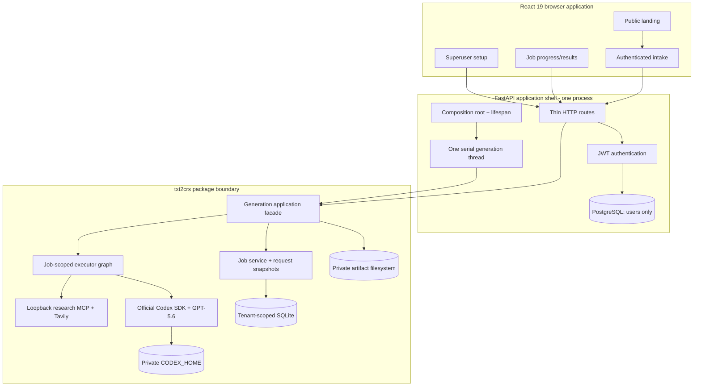

# Input-to-Course System Implementation Plan

> **Plan status:** Final - implementation-ready
> **Delivery status:** Application shell partially integrated; P0 workflow not
> implemented
> **Baseline release:** 0.3.1
> **Created:** 2026-07-18
> **Last verified:** 2026-07-19
> **Owner:** txt2crs project

This is the final implementation plan for the txt2crs hackathon application.
It resolves the product, architecture, persistence, runtime, API, security,
frontend, testing, deployment, and submission decisions that must be settled
before implementation begins.

The plan is based on:

- the adopted [txt2crs folder architecture](../TXT2CRS_FOLDER_ARCHITECTURE.md);
- the [feature and submission plan](../../make-scenarios/FEATURE_AND_SUBMISSION_PLAN.md);
- the reconstructed [legacy system](../../make-scenarios/LEGACY_SYSTEM_REFERENCE.md)
  and [generation pipeline](../../make-scenarios/GENERATION_PIPELINE.md);
- the implemented
  [txt2crs package](../../backend/packages/txt2crs/README_txt2crs.md);
- the local [Build Week requirements](OPENAI_BUILD_WEEK_REQUIREMENTS.md);
- the current [OpenAI Build Week page](https://openai.devpost.com/);
- the official [Codex Python SDK](https://learn.chatgpt.com/docs/codex-sdk#python-library),
  [Codex app-server](https://learn.chatgpt.com/docs/app-server), and
  [device-code login](https://learn.chatgpt.com/docs/app-server#3b-log-in-with-chatgpt-device-code-flow)
  documentation; and
- current [GPT-5.6 model guidance](https://learn.chatgpt.com/docs/models#choosing-sol-terra-and-luna).

## 1. Executive decision

Build the smallest honest end-to-end product that demonstrates the complete
education value loop:

```text
authorized learner input
  -> durable private job
  -> bounded GPT-5.6 and research pipeline
  -> validated course bundle
  -> 16 deterministic private artifacts
  -> refresh-safe results workspace
```

The implementation order is reliability first, then experience, then
submission. A feature does not count as implemented merely because a package
component exists; it must be composed, reachable, secured, tested, and
demonstrable through the application.

### Submission priorities

| Priority | Scope |
|---|---|
| P0 | One complete authenticated submit -> progress -> results journey, explicit GPT-5.6 readiness, private artifacts, restart recovery, polished UI, and submission materials |
| P1 | Library/history, owner cancellation, coordinated deletion and retention, email notification, explicit language/RTL and accessibility controls, and optional media modes |
| P2 | Payments, public sharing, Drive/LMS export, collaborative editing, automatic grading, multi-organization administration, and provider switching |

P1 work must not begin until the P0 application, production image, live
representative run, README, published video, and confirmed Devpost submission
are all green.

## 2. Product contract

### Product promise

A learner supplies a topic, pasted source, public URL, YouTube link, or
supported document. txt2crs researches the subject, designs and writes a
source-grounded course, creates comprehensive review material, derives an
aligned assessment, and privately delivers a separate instructor answer key.

The browser is a primary product surface, not an API wrapper. It must explain
what the system is doing, make long-running work trustworthy, and present the
results as finished educational publications.

### Deliverables

One successful job produces exactly four aligned deliverables:

| Deliverable | Intended use | Formats |
|---|---|---|
| Course | Source-grounded curriculum and lessons | HTML, Markdown, PDF, DOCX |
| Review Pack | Summaries, glossary, misconceptions, flashcards, worked examples, practice, and review sequence | HTML, Markdown, PDF, DOCX |
| Student Assessment | Blueprint-aligned test without answers | HTML, Markdown, PDF, DOCX |
| Instructor Answer Key | Answers, evidence, scoring guidance, and rubrics | HTML, Markdown, PDF, DOCX |

The owner can access all four deliverables. P0 does not implement separate
student and instructor roles, so the interface must label and visually isolate
the answer key without claiming role-based distribution controls.

### Supported input matrix

The UI must advertise only modes that the deployed backend reports as ready.

| Input | P0 | Notes |
|---|---|---|
| Topic/prompt | Required | Short topic or instruction |
| Pasted text | Required | Bounded plain text |
| Public webpage URL | Required | Engine SSRF and extraction controls remain authoritative |
| YouTube URL | Required | Auto-detect and use the transcript adapter; never treat it as a generic webpage |
| PDF | Required | Text PDF, bounded by bytes and pages |
| DOCX | Required | Paragraph and table extraction |
| PPTX | Required | Visible slide text extraction |
| Image OCR | P1 | Requires Tesseract, image-specific limits, readiness checks, and representative tests |
| Audio/video transcription | P1 | Requires the optional transcription dependency, ffmpeg, model storage, duration limits, and deployment capacity |

The P0 upload cap is 20 MiB. The limit is deliberately below the package's
theoretical maximum because the first deployment stores immutable request
payloads in tenant-scoped SQLite and runs on one demo node. Raising it requires
an input-store and capacity review.

### P0 success measures

- A signed-out visitor understands the one-input-to-four-deliverables story
  from the public landing page.
- An authenticated user can submit every enabled P0 input mode.
- The API acknowledges only after the exact request is durably stored.
- Duplicate submission cannot create duplicate paid work.
- Research precedes curriculum drafting and sources are visible in the result.
- Refreshing or reopening a job URL preserves truthful progress.
- A backend process restart resumes accepted work from the latest checkpoint.
- One completed job exposes 16 owner-scoped, integrity-checked artifacts.
- No browser response contains credentials, raw provider events, prompts,
  hidden reasoning, private diagnostics, or filesystem paths.
- The complete desktop and mobile journey is keyboard accessible and respects
  reduced-motion preferences.
- A real gated run uses an explicitly selected GPT-5.6 model with no silent
  fallback.

### Submission non-goals

Do not implement the following before the submission gate:

- Make.com, Airtable, Paperform, or Google Drive reconstruction;
- payments, coupons, subscriptions, or service tiers;
- public or anonymous artifact links;
- LMS export, interactive quiz-taking, or automatic grading;
- course editing, plan approval, or collaboration;
- multiple concurrent Codex workers or a queue platform;
- broad analytics dashboards;
- a generalized model/provider selector; or
- hosted deployment, platform-specific CD, domains, or TLS automation. Local
  Docker is the only deployment target in this project scope; any later
  production-hosting decision requires an explicit owner-approved scope change
  and a new ADR.

## 3. Verified repository state

The earlier plan marked boilerplate adoption complete. That is not accurate
against the current repository. The application shell is present, but the
phase exit criteria are not yet satisfied.

| Area | Verified state on 2026-07-19 | Consequence |
|---|---|---|
| FastAPI auth/users and React shell | Present | Reuse |
| `txt2crs` uv workspace dependency | Host import works | Reuse |
| Engine deterministic suite | 223 passed; 1 credential-gated live test skipped | Preserve; replace the live GPT-5.4 preference before running the explicit GPT-5.6 gate |
| Engine validation in `scripts/validate-changes.sh` | Present | Reuse and keep green |
| Demo `items` domain | Still present across backend, frontend, docs, tests, and admin MCP | Remove only after jobs replace it |
| Backend Dockerfile workspace copy | Missing `packages/` copy before `uv sync` | Production image is not yet an accepted engine integration |
| Backend process count | Dockerfile starts four workers | Incompatible with the one in-process engine worker |
| Persistent engine state | No state/artifact/Codex volume or environment wiring | Credentials, SQLite state, and artifacts are not deployment-safe |
| Engine composition root | Missing | Required |
| System readiness/setup API and UI | Missing | Required |
| Jobs API and frontend | Missing | Required |
| Application acceptance tests | Placeholder only | Required before implementation |
| Engine request recovery query | Missing | Package gap must be closed |
| Safe job/result query facade | Missing | Package gap must be closed |
| Per-artifact manifest/read API | Store currently restores the whole bundle | Package gap must be closed |
| Integrated YouTube dispatch | Adapter exists, but `InputType` and dispatcher do not distinguish YouTube from generic URL | Package gap must be closed |
| Preference enforcement | UI concepts such as `Auto`, explicit level, and learning goals are not deterministic package contracts | Package gap must be closed or omitted |

Therefore:

- Phase 0 below is **partially complete**, not complete.
- Phases 1 through 5 are **not started**.
- Existing package capabilities remain valuable, but the application must not
  overstate capabilities until their integration tests pass.

## 4. Adopted architecture



### Responsibility boundaries

| Boundary | Owns | Must not own |
|---|---|---|
| React | Forms, client validation, public-safe polling, previews, downloads, visual states | Provider logic, authorization decisions, hidden progress, or filesystem paths |
| FastAPI shell | HTTP, JWT identity, superuser checks, settings, lifespan, error translation, response headers | Generation, research, checkpoint, artifact-integrity, or job-persistence logic |
| PostgreSQL | Users, credentials, profile/admin data | A shadow generation-job state machine |
| txt2crs facade | Submission, immutable request snapshot, job queries, recovery discovery, safe projections, artifact access, deletion hooks | FastAPI or SQLModel application imports |
| Engine SQLite | Job rows, admission reservations, exact request envelope, checkpoints, delivery state | User email/password records |
| Artifact store | Immutable rendered bytes, integrity manifest, owner scoping | Public links |
| Codex SDK | ChatGPT authentication, model discovery, model turns, token refresh | Application authorization |
| Research MCP | Only `research_search` and `research_extract` on loopback | Admin MCP duties or arbitrary tools |

### Persistence decision

There will be no PostgreSQL `CourseJob` shadow table in P0.

The engine SQLite store is the single source of truth for generation jobs.
PostgreSQL supplies only the authenticated UUID, which is converted to a
string and passed as `user_id`. This avoids dual-write status drift.

Before returning `202 Accepted`, the package must atomically persist:

- the owner and idempotency key;
- a hash of every generation-affecting request field;
- the bounded raw input value or bytes;
- verified media type and safe display file name;
- normalized request metadata;
- learner preference intent and the selected server-default policy version;
- consent and age-group policy context;
- the immutable execution profile: engine, prompt, policy, model, reasoning,
  retry, and budget versions/values;
- configured admission reservation; and
- creation timestamps and schema versions.

For the single-node P0 deployment, the raw request value may be stored as a
bounded SQLite TEXT/BLOB in a new packaged migration. It must never be placed
in PostgreSQL, logs, task arguments visible to the browser, or an untracked
temporary directory.

The execution profile is part of the canonical request and is reused during
recovery. A deploy that cannot execute a persisted non-terminal profile must
fail closed with a safe compatibility error; it must not substitute the
current model, prompt, policy, or limits. P0 deployments should drain the one
active job before any intentionally incompatible engine upgrade.

### Process model

P0 runs:

- one Uvicorn/FastAPI process;
- one serial generation worker thread;
- at most one active course job;
- one application-owned persistent state volume; and
- no Celery, Redis, RabbitMQ, or external queue.

Four Uvicorn workers are explicitly prohibited. The current Dockerfile must be
changed to `--workers 1`. Multiple backend processes would duplicate lifespan
workers, race on one dedicated Codex identity, and violate the current SQLite
and in-process supervision assumptions.

The durable database is the queue. The worker polls for the next runnable job
and is nudged by an in-process event after a successful submission. The event
is only a latency optimization; startup scanning and periodic polling are the
recovery mechanisms.

### Resource lifetime

Application-scoped resources:

- settings and reviewed source policy declarations;
- SQLite job store and private artifact store;
- dedicated system authenticator;
- worker supervisor and shutdown signal; and
- the last safe readiness snapshot.

Job-scoped resources:

- a fresh `RunBudget` initialized from the stored execution profile;
- a fresh `CancellationToken`;
- research guardrails and retry controller;
- `ResearchToolService` and loopback `ResearchMcpApplication`;
- `OfficialCodexSdkAdapter` and `CodexSubscriptionRuntime`;
- research coordinator, ingestion service, pipeline, and executor.

A mutable `RunBudget` must never be reused between jobs. Each job graph is
closed in a `finally` block so the Codex app-server, MCP listener, HTTP client,
and temporary worker resources cannot leak across jobs.

### Recovery behavior

On startup, the worker discovers jobs in:

- `accepted`;
- `researching`;
- `drafting`;
- `validating`;
- `rendering`; and
- `delivering`.

It loads the exact stored request and execution profile and invokes the
executor from the latest accepted checkpoint. Resolved auto-preferences are
loaded from their checkpoint once one exists. `completed`, `failed`, and
`cancelled` jobs are never re-executed.

The worker checks the dependencies required by the next stage before claiming
work. If authentication/research is unavailable, provider-dependent work stays
at its durable checkpoint with bounded polling backoff; it is not falsely
failed and does not make provider calls. Local rendering or delivery recovery
may continue when its own storage checks pass. Once a stage starts, existing
finite retry and budget rules apply; an exhausted classified failure becomes a
safe terminal failure rather than an infinite retry loop.

Graceful shutdown stops accepting new claims and lets the active call drain
for a bounded interval. A deployment shutdown must not convert an interrupted
job to user cancellation. If the container is terminated, the last durable
non-terminal state remains recoverable on restart.

## 5. Required txt2crs package gap closures

These are engine-boundary tasks, not shell workarounds. Tests are written
before each implementation.

### 5.1 Durable generation request

Add a strict, versioned `GenerationRequest` contract that contains:

- `InputPayload`;
- a strict preference-intent contract;
- provider consent;
- a package-owned `minor`, `adult`, or `not_provided` age-group enum;
- server-selected policy flags;
- an immutable `ExecutionProfile` containing the model ID, reasoning
  settings, engine/prompt/policy contract versions, retry policy, and finite
  run-budget limits;
- request and schema versions; and
- a canonical request hash.

Add a packaged SQLite migration and service methods to atomically store and
load this envelope with the job. Idempotency compares the complete canonical
request, not only the source bytes. Reusing a key with different preferences,
policy context, execution profile, or input must fail closed.

### 5.2 Runnable-job discovery

Add an owner-safe internal query for the single worker to discover the next
runnable job in deterministic order. Delivery/rendering recovery takes
priority over new accepted work, then older jobs take priority.

The shell must not query engine tables directly.

### 5.3 Public job projection

Add a package projection that converts a `JobRecord` plus the latest
checkpoint into an allowlisted public snapshot. It may expose:

- public job state and timestamps;
- last accepted stage;
- bounded completed/total units;
- safe input type/display metadata and extraction warnings;
- safe failure code/message;
- course title after it exists;
- source title, canonical URL, publisher, and retrieval date;
- unresolved-conflict summaries; and
- artifact availability.

It must not expose normalized source text, evidence excerpts, prompts, model
events, provider IDs, thread/turn IDs, token material, private diagnostics, or
checkpoint JSON.

### 5.4 Artifact query boundary

Extend the artifact protocol and filesystem implementation with:

- an owner-scoped manifest read that does not load every artifact body;
- an owner-scoped context-managed single-artifact stream by stable artifact
  ID;
- size, media type, safe file name, hash, deliverable, and format metadata; and
- the same symlink, path-confinement, byte-limit, and integrity checks as the
  current full-bundle read.

The package opens one file descriptor, validates confinement/metadata, hashes
the bounded content, seeks that same descriptor back to zero, and only then
yields chunks. FastAPI closes the package context on completion/disconnect; it
never receives or opens an artifact path.

### 5.5 Integrated input dispatch

Add one package-owned `RoutingUrlAdapter` registered for the existing `url`
input type. It validates the URL once, sends recognized YouTube hosts to
`YouTubeTranscriptAdapter`, and sends every other supported public URL to
`UrlAdapter`. The shell must not parse hosts or choose adapters.

Add deterministic handling for:

- `language="auto"` -> detected input language after ingestion;
- `level="auto"` -> the schema-constrained level selected by the existing
  course-planning turn, with explicit levels enforced when set;
- explicit learning goals; and
- stable defaults for audience, prior knowledge, duration, tone,
  accessibility, assessment length, and passing score.

Persist resolved preferences with the accepted course-plan checkpoint before
module drafting so a restart cannot reinterpret `auto`. Extend the concrete
package learning contract with explicit `level` and `learning_goals`; do not
overload `desired_depth` with either meaning. Explicit learning goals must map
to course objectives or fail local alignment validation.

Adopt these P0 resolver defaults:

| Preference intent | Resolved P0 behavior |
|---|---|
| Audience omitted | Infer a concise audience in the existing planning turn and display it in results |
| Prior knowledge omitted | Assume no prerequisite knowledge unless the source clearly establishes it |
| Learning goals empty | Derive measurable objectives in the existing planning turn |
| Level `auto` | Planning selects beginner/intermediate/advanced/mixed |
| Language `auto` | Use deterministic ingestion detection; English is the existing fallback when no supported script is detected |
| Desired depth | Comprehensive, foundational-to-applied |
| Duration | 120 minutes |
| Tone | Clear, rigorous, and encouraging |
| Accessibility | Semantic headings, plain-language definitions, and textual explanations of visual concepts |
| Assessment length | 15 mixed-format items |
| Passing score | 70 percent |
| High-risk flag | Derived only by package policy; never client-controlled |

The P0 `CurriculumShapeLimits` stored in the execution profile are 5 to 12
objectives, 3 to 6 modules, 2 to 5 sections per module, and 3 to 12 content
blocks per section. Add a local course-plan gate that enforces these bounds
plus explicit audience, prior-knowledge, language, level, duration,
accessibility, and goal alignment. A plan that violates preference or shape
limits may use the existing bounded repair allowance once; it never proceeds
to module drafting on prompt compliance alone.

If a field is offered in the UI, the package must either enforce it or
explicitly document it as advisory. P0 must not collect inert fields.

### 5.6 Post-ingestion policy gate

The existing pre-provider `ContentPolicy` cannot assess a binary document when
the only request text is its file name. Add a two-stage package policy:

1. At submission, validate consent, age-group shape, and any available
   prompt/text/URL request language.
2. After bounded ingestion, evaluate normalized content before any
   Codex turn or research call.

Refactor execution into an AI/research-provider-free preparation stage and a
generation stage. Preparation ingests once, persists the cumulative
`InputDocument`, evaluates policy, and checkpoints the accepted policy
decision. Only then may the factory start Tavily/MCP/Codex resources and pass
the prepared document into the pipeline. Recovery reuses that checkpoint and
never refetches a URL, transcript, or uploaded document merely to re-run
policy.

The package, not FastAPI, maps the age group to policy behavior. For an
accepted job, store the policy version and safe decision code with the
checkpoint. A post-ingestion rejected or high-risk/review outcome becomes a
safe terminal result in P0 because no qualified-review workflow exists. No
provider work may follow that decision. Its reservation remains subject to the
existing rolling admission window, preventing rejected uploads from becoming
a quota-bypass path.

### 5.7 Managed research MCP lifecycle

The current FastMCP entry point is blocking and exposes no managed stop
contract. Add a package-owned lifecycle that:

- starts the loopback HTTP server on the configured private port;
- waits for a bounded ready signal and verifies exactly two registered tools;
- exposes its URL only after readiness;
- stops and joins cleanly after the Codex runtime closes; and
- surfaces bind, startup, timeout, and shutdown failures as typed package
  errors.

The readiness probe uses the same managed lifecycle, then closes it. The
application must never publish this port or leave the probe running.

### 5.8 Notification semantics

Completion email is P1. P0 must support an explicit `disabled` notification
policy without pretending an email was sent.

Replace the current nullable "notified" meaning with a versioned delivery
notification mode/status. P0 records `mode=disabled` and
`status=not_applicable`, commits artifacts/delivery, and marks the job
completed without calling a sink.

Before SMTP is enabled, keep job completion independent from email. P1 records
a pending outbox entry, commits artifacts/delivery, marks the course job
completed, and lets a separate durable outbox worker send/retry afterward.
The outbox has `pending`, `sent`, and terminal `failed` states. A failed email
may create an operator-visible warning, but it never changes a completed
course job to failed or leaves it stuck in `delivering`.

### 5.9 Owner purge

Add an idempotent package operation that deletes all job requests,
checkpoints, delivery rows, and artifacts for one owner. Existing self-delete
and admin user-delete routes must call this operation before deleting the
PostgreSQL user so their current "all associated data" promise remains true.

### 5.10 GPT-5.6 compatibility gate

The live acceptance test currently prefers GPT-5.4. Before application wiring:

1. Set the application default to `gpt-5.6` (the Sol alias) unless a reviewed
   GPT-5.6 slug is configured.
2. Require model discovery to contain the configured GPT-5.6 model.
3. Remove silent fallback to the first available or an older model.
4. Run one schema-constrained turn and one allowlisted MCP tool call.
5. If the pinned beta SDK/runtime cannot expose or run GPT-5.6, upgrade the
   SDK and bundled CLI pins together, regenerate the committed protocol
   fixtures, review the diff, and rerun every engine contract test.

Readiness must report unavailable rather than silently changing models.

### 5.11 Public application facade and factories

Add one documented package boundary, for example
`txt2crs.application.Txt2CrsApplication`, that exposes only the operations the
shell needs:

- submit and recover;
- read a public job snapshot;
- read an artifact manifest or one artifact;
- inspect safe readiness/auth state;
- discover runnable work;
- create and close one executor graph; and
- purge an owner.

The package also owns typed real and deterministic-test factories for
ingestion, source policy, Tavily, research MCP, Codex, pipeline, store, and
rendering composition. FastAPI may translate typed shell settings into the
package configuration and inject test factories, but it must not import
private engine modules or reconstruct that graph itself.

## 6. Public API contract

All routes use strict request models, generated OpenAPI clients, application
`ErrorCode` values, RFC 9457 Problem Details, trace IDs, and authenticated
owner context. Route handlers remain thin adapters around the package facade.

### P0 routes

| Method/path | Auth | Responsibility |
|---|---|---|
| `GET /api/v1/system/readiness` | Authenticated | Coarse safe readiness and enabled input capabilities |
| `POST /api/v1/system/auth/start` | Superuser | Start one app-server device-code login |
| `GET /api/v1/system/auth/status` | Superuser | Poll the browser-safe login snapshot |
| `POST /api/v1/jobs` | Authenticated | Submit prompt, text, URL, or YouTube JSON |
| `POST /api/v1/jobs/upload` | Authenticated | Stream and submit one verified document upload |
| `GET /api/v1/jobs/{job_id}` | Owner | Public-safe status, progress, warnings, and result summary |
| `GET /api/v1/jobs/{job_id}/artifacts` | Owner | Integrity-checked artifact manifest grouped by deliverable |
| `GET /api/v1/jobs/{job_id}/artifacts/{artifact_id}` | Owner | Stream one preview or attachment |

### P1 routes

| Method/path | Auth | Responsibility |
|---|---|---|
| `GET /api/v1/jobs` | Owner | Paginated library/history |
| `POST /api/v1/jobs/{job_id}/cancel` | Owner | Cancel accepted or active work |
| `DELETE /api/v1/jobs/{job_id}` | Owner | Coordinated request/checkpoint/artifact deletion |
| `POST /api/v1/system/auth/logout` | Superuser | Disconnect the dedicated identity |

### Submission requests

Both submission routes require an `Idempotency-Key` header:

- `^[A-Za-z0-9._:-]{1,128}$`, scoped to the authenticated owner;
- generated before the frontend sends the request;
- reused for transport retry and double-click replay; and
- replaced only when the learner intentionally creates a new job.

The package computes the canonical request hash. The same owner, key, and hash
returns the original job without a second admission reservation; the same key
with a different hash returns `JOB_IDEMPOTENCY_CONFLICT`. JSON and upload
submissions share the same owner-scoped key namespace.

The JSON route accepts a discriminated input:

```json
{
  "input": {
    "type": "prompt",
    "value": "Teach first-year students how relational indexes work."
  },
  "preferences": {
    "level": "auto",
    "audience": null,
    "prior_knowledge": null,
    "learning_goals": [],
    "language": "auto"
  },
  "consent_to_ai_processing": true,
  "learner_age_group": "adult"
}
```

P0 request bounds are part of both Pydantic and Zod contracts:

| Field | Bound |
|---|---|
| Topic/prompt | 3 to 10,000 stripped characters |
| Pasted text | 1 to 200,000 normalized characters |
| URL | One absolute `https` URL, at most 2,048 characters |
| Audience | Optional, at most 500 characters |
| Prior knowledge | Optional, at most 2,000 characters |
| Learning goals | At most 10 goals, each 3 to 500 characters |
| Upload | Exactly one PDF/DOCX/PPTX, at most 20 MiB |
| PDF | At most 200 pages |
| Age group | Exactly `minor`, `adult`, or `not_provided` |
| Consent | Literal `true` |

Whitespace-only values and unknown fields are rejected. URL public-network,
redirect, DNS-rebinding, response-byte, and normalized-text checks remain
package-owned even after the shell validates the request shape.

Allowed P0 age values are `minor`, `adult`, and `not_provided`. The shell maps
none of them to an invented birth date; it passes the enum to the package,
which owns policy interpretation.

The upload route accepts multipart form data containing:

- one metadata JSON field validated by the same strict request model;
- exactly one `UploadFile`;
- no client-provided filesystem path;
- a required idempotency header; and
- no client-selected model, budget, admission, owner, or review-approval
  fields.

The server streams the upload through a byte counter and hash. It must not call
an unbounded `read()`. Extension, declared content type, and magic bytes must
agree before the package accepts the payload. Reject an oversized declared
`Content-Length` early, but retain the streaming counter for absent or false
lengths. Any framework spool file is private, bounded, closed, and removed in
a `finally` block after the package commit or rejection.

Submission ordering is fixed:

1. Authenticate, rate-limit, and validate/stream the bounded transport.
2. Run package preflight policy. Missing consent or a policy-rejected
   prompt/text request returns 422 and creates no job.
3. Resolve server-selected execution/profile values and compute the canonical
   request hash.
4. Atomically reserve admission and persist the job plus immutable request.
5. Return `202`; only the worker may begin ingestion/provider work.

An upload or fetched source can still fail the post-ingestion policy
asynchronously. That accepted job becomes `failed` with a safe policy code,
retains its rolling admission reservation, and is presented as rejected or
review-required without provider work.

Both routes return `202 Accepted` only after durable request commit:

```json
{
  "schema_version": "1.0",
  "job_id": "job-...",
  "status": "accepted",
  "status_url": "/api/v1/jobs/job-..."
}
```

### Public job response

`GET /jobs/{job_id}` returns an allowlisted response with:

- `schema_version`, `job_id`, `status`, `revision`;
- `created_at`, `updated_at`;
- `progress.stage`, a bounded safe `progress.message`, `completed_units`, and
  nullable `total_units` until a course plan fixes the module count;
- safe input type, display name, size, and extraction warnings;
- a safe failure object when terminal;
- a result summary with title, resolved audience/level/language,
  objective/module counts, bounded sources, and bounded conflict summaries
  when enough accepted state exists; and
- an artifact-manifest URL only after private delivery is committed.

Cap warnings and conflict summaries at 20 entries, source summaries at 12
entries, and every browser-safe message at 500 characters. The projection
reports truncation explicitly rather than growing a polling response without
bound.

`review_required` is a UI outcome derived either from a synchronous policy
Problem Detail or from a failed job whose safe failure code is
`high_risk_review_required`; it is not falsely presented as an engine
`JobStatus`. P0 explains that qualified review is unavailable and the course
was not generated.

### Job-state presentation

| Engine status/checkpoint | Browser language |
|---|---|
| `accepted` | Queued securely |
| `researching` + `ingest_input` | Reading and checking the source |
| `researching` + `policy_accepted` | Source accepted for generation |
| `researching` + `plan_research` | Planning the research |
| `drafting` + `collect_evidence` | Sources collected; designing the course |
| `drafting` + module checkpoints | Writing module N of M |
| `validating` | Aligning review and assessment material |
| `rendering` | Creating publication formats |
| `delivering` | Securing the finished files |
| `completed` | Ready |
| `failed` | Safe failure or review-required explanation |
| `cancelled` | Cancelled |

Progress is checkpoint-based and monotonic. It is not a fabricated percentage
and must not reveal provider streaming text.

### Polling

P0 uses TanStack Query polling, not SSE or WebSockets:

- poll every 1.5 seconds while the tab is visible and the job is non-terminal;
- poll every 10 seconds while hidden;
- back off network failures from 3 to at most 30 seconds with jitter;
- stop on terminal state;
- resume automatically after refresh; and
- use `revision` to suppress duplicate UI announcements/animation.

Polling is the lowest-risk refresh-safe fit for one long-running worker. A
streaming transport may be added later without changing the job contract.
P0 does not add ETag/304 handling; status responses are small and
`Cache-Control: private, no-store` remains unambiguous.

### Error mapping

Add job/system codes to `app.core.constants.ErrorCode` and map them centrally:

| Error code | HTTP | Meaning |
|---|---:|---|
| `JOB_6001` (`JOB_NOT_FOUND`) | 404 | Missing job or wrong owner; never distinguish the two |
| `JOB_6002` (`JOB_IDEMPOTENCY_CONFLICT`) | 409 | Same key, different canonical request |
| `JOB_6003` (`JOB_INVALID_STATE`) | 409 | Operation is invalid for the current state |
| `JOB_6004` (`JOB_INPUT_TOO_LARGE`) | 413 | Bounded input limit exceeded |
| `JOB_6005` (`JOB_UNSUPPORTED_INPUT`) | 415 | Unsupported or mismatched media |
| `JOB_6006` (`JOB_POLICY_REJECTED`) | 422 | Consent/content/age policy refusal |
| `JOB_6007` (`JOB_QUOTA_EXCEEDED`) | 429 | Admission reservation refused |
| `JOB_6008` (`ARTIFACT_NOT_FOUND`) | 404 | Missing artifact or wrong owner |
| `SYSTEM_7001` (`SYSTEM_NOT_READY`) | 503 | Provider, research, or storage not ready |
| `SYSTEM_7002` (`SYSTEM_AUTH_FAILED`) | 502 | Safe device-auth start/status failure |

Add `PAYLOAD_TOO_LARGE = 413` and `UNSUPPORTED_MEDIA_TYPE = 415` to
`HTTPStatusCode`. Provider details remain in private structured logs only after
sanitization.

## 7. Readiness, authentication, and security

### Composite readiness

`GET /system/readiness` reports `accepting_jobs=true` only when all required
checks pass:

- dedicated ChatGPT authentication is valid;
- configured model is a discovered GPT-5.6 model;
- subscription quota is reported honestly as `unknown` when the SDK cannot
  expose it;
- Tavily key and reviewed source policy are present;
- loopback research MCP can start and register exactly two tools;
- SQLite migrations are current and the state directory is writable;
- artifact storage can atomically write/read/delete a probe;
- the worker thread is alive and not shutting down; and
- all required P0 input adapters are enabled; and
- admission control has capacity for one more durable request.

Liveness and readiness are separate. Docker health must not restart the
backend merely because the operator has not authenticated Codex.

Destructive storage and managed-MCP probes run during startup and at a bounded
maintenance interval, not once per browser poll. Model/auth checks use a
short-lived safe cache. The endpoint reads the latest snapshot and never
starts a server, writes a probe, or launches a provider call synchronously.
Readiness refresh, device login, and job execution share one runtime-ownership
lock. While a job is active, readiness returns the latest safe snapshot and
never launches a second Codex app-server.

The safe response contains only `schema_version`, overall `status`,
`accepting_jobs`, configured GPT-5.6 model ID, enabled input modes, coarse
check states, warnings, recovery actions, and `checked_at`. It does not expose
account identity, quota guesses, secrets, provider payloads, paths, ports, or
private exception text.

### Device-code setup

The package-owned `DedicatedSystemAuthenticator` remains the only device-code
implementation.

- `/setup` and auth start/status routes are superuser-only.
- The frontend displays only the validated OpenAI verification URL, short
  code, safe status, and recovery message.
- The browser never receives OAuth tokens, account email, raw provider errors,
  or `CODEX_HOME`.
- Only one login attempt may be active.
- Auth start/logout is refused while a job owns the dedicated runtime; status
  polling for an already-started ceremony remains available.
- The CLI bootstrap remains a documented recovery path until the browser flow
  passes a live test.
- Credentials stay in an application-owned persistent `CODEX_HOME` with owner
  only permissions.

### Model policy

- `TXT2CRS_MODEL_ID` defaults to `gpt-5.6`.
- Sol is selected because the workload is complex research and polished
  document generation.
- Accepted configured slugs are the discovered GPT-5.6 family only:
  `gpt-5.6`, `gpt-5.6-sol`, `gpt-5.6-terra`, or `gpt-5.6-luna`.
- The model is checked through app-server discovery at readiness and again
  before a turn.
- There is no fallback to GPT-5.4, to the first discovered model, or to an API
  key.
- Any later choice of Terra or Luna requires a recorded eval comparison and
  still satisfies the GPT-5.6 requirement.

Preserve the existing runtime isolation on every turn: an empty worker root,
read-only sandbox, deny-all local approvals, ephemeral thread, exact base
instructions, cleared inherited MCP configuration, and only the two required
research tools. Strip OpenAI/Codex API keys and the Tavily key from the Codex
child environment; Tavily remains reachable only behind the loopback MCP
service.

### Upload and content security

- Enforce request-size limits at HTTP streaming and engine ingestion layers.
- Apply the same cap at Traefik/ASGI ingress so multipart parsing cannot spool
  an unbounded request before route validation.
- Use safe display basenames only; never use an uploaded name as a storage
  path.
- Validate PDF/DOCX/PPTX signatures and reject corrupt, encrypted, unsupported,
  or decompression-bomb inputs.
- For DOCX/PPTX, require a valid ZIP signature and expected OOXML content
  types, cap entry count and expanded bytes, ignore macros/active content, and
  never execute embedded objects.
- Keep URL safety, DNS, redirect, and extraction policy in the engine.
- Treat uploaded, fetched, transcribed, and model-generated content as
  untrusted data.
- Never place untrusted text in system/developer instructions.
- Never render model-produced HTML; use only deterministic engine renderers.

### Artifact security

- Every artifact call supplies the current authenticated UUID as `user_id`.
- Wrong-owner access returns the same 404 as a missing object.
- Downloads use stable artifact IDs, not paths or arbitrary filenames.
- Set `X-Content-Type-Options: nosniff`.
- Set `Cache-Control: private, no-store` for status, manifest, and artifact
  responses.
- Set attachment `Content-Disposition` with the engine-safe filename.
- Fetch HTML bytes through the authenticated artifact client, pass them to an
  iframe through `srcDoc` or a revocable Blob URL, and never inject them into
  the parent React document with `dangerouslySetInnerHTML`.
- Apply iframe `sandbox` with no script, form, popup, navigation, or
  same-origin privileges, plus a restrictive CSP inside the preview document.

P0 trusts the single local host/container boundary, not other OS users. Local
state is protected by owner-only permissions. Hosted storage is outside this
project scope; if the owner later approves it, storage and backup requirements
must be defined before implementation. Application-level per-owner encryption
is a future multi-tenant storage decision, not a substitute for the P0
authorization and confinement checks.

### Logging and privacy

All new log events follow `{domain}.{action}_{state}`, for example:

- `system.readiness_validated`;
- `job.submission_started`;
- `job.submission_completed`;
- `job.execution_started`;
- `job.checkpoint_completed`;
- `job.execution_failed`;
- `artifact.download_completed`; and
- `system.authentication_failed`.

Logs may include opaque job/user UUIDs, stage, revision, trace ID, duration,
and safe error code. They must not include email, input content, source
excerpts, prompts, user code, tokens, provider payloads, artifact bytes, or
filesystem paths.

Submission/auth routes retain the shell's rate limiting outside local
development. Rate limiting protects HTTP abuse; engine admission remains the
authoritative protection against duplicate or excessive paid work.

### Account deletion

The existing self-service and admin user deletion routes must:

1. return `JOB_INVALID_STATE` while any owner job is non-terminal, or drain it
   during an explicitly tested operator workflow;
2. invoke the idempotent engine owner purge;
3. delete PostgreSQL user data only after engine purge succeeds; and
4. surface a structured failure instead of claiming deletion succeeded.

Deleting engine data first is privacy-safe if the later PostgreSQL commit
fails; the remaining user can retry.

### Demo access policy

The local judge/demo deployment is not an open generation service backed by
one ChatGPT subscription. Public signup remains available only in developer
mode. The local judge/demo mode sets `ENABLE_PUBLIC_SIGNUP=false`; an operator
provisions a bounded judge account and shares access through the allowed
submission channel. The landing and sign-in pages remain viewable without
authentication.

## 8. Frontend experience

### Route map

| Route | Access | Experience |
|---|---|---|
| `/` | Public | Product story, four deliverables, sample transformation, and sign-in/create CTA |
| `/login` | Public | Branded sign-in that preserves a drafted prompt when practical |
| `/signup` | Developer public; judge/demo invite-only | Registration form in developer mode; operator-provisioned access message in local judge mode |
| `/create` | Authenticated | Focused multimode intake |
| `/jobs/$jobId` | Owner | Progress that transforms into results on the same durable URL |
| `/setup` | Superuser | Dedicated ChatGPT and system readiness |
| `/library` | Owner, P1 | Job history, reopen, delete, and retention state |

The current protected `_layout/index.tsx` cannot remain the only `/` route,
because a signed-out visitor otherwise sees no product story. Move the
authenticated workspace to `/create` and make `/` public.

### Intake

The P0 form contains:

- topic/prompt, pasted text, URL, and upload modes;
- local pre-submit preview of text, URL, file name, media type, and size;
- optional audience and prior knowledge;
- optional learning goals;
- level with `Auto`, beginner, intermediate, advanced, and mixed;
- privacy-minimized learner age group;
- required AI/research processing consent;
- a clear sample input; and
- one primary submit action guarded against repeated clicks.

Implement it with React Hook Form plus the centralized Zod schema, the
generated OpenAPI client, branded `JobId`/`ArtifactId`/`IdempotencyKey` types,
`crypto.randomUUID()`-based keys, and the shared `handleApiError()` Problem
Detail path. Do not hand-code a parallel fetch contract.

Do not expose language, duration, tone, assessment count, passing score,
high-risk flags, model, or budget controls in P0. Use reviewed server defaults.
Add controls only when they have deterministic package behavior and enough UI
space.

### Progress

Generation is shown as a real course-building timeline:

- source checked;
- research plan ready;
- sources collected;
- curriculum designed;
- modules drafted;
- review pack generated;
- assessment aligned;
- formats rendered; and
- files secured.

The screen uses checkpoint-derived counts and safe narration. It includes:

- a persistent job identifier copy action;
- safe extraction warnings;
- a reconnecting state for transient network loss;
- an elapsed-time message without promising an exact completion time;
- a refresh-safe error boundary; and
- deliberate terminal failed, review-required, and cancelled states.

It never uses a bare spinner as the entire experience and never invents
provider activity.

### Results

Results reveal four primary cards, not a flat list of 16 files.

Each card includes:

- title and purpose;
- HTML preview action when available and below the preview byte cap;
- PDF as the primary recommended download;
- HTML, Markdown, PDF, and DOCX in the secondary format menu;
- size and format labels; and
- accessible loading/error states.

The course result also displays:

- source titles and canonical links;
- retrieval information;
- unresolved/conflicting claim disclosure; and
- a plain-language quality/privacy explanation.

The answer key card is visually separated, collapsed by default, and marked as
instructor material.

### Visual direction

Use a "research atelier" direction: warm publication surfaces, strong editorial
typography, restrained technical accents, and a transformation motif that
moves from one source tile into four finished publications.

Requirements:

- no default boilerplate dashboard appearance on learner surfaces;
- a clear story in the first desktop viewport;
- one excellent light-first warm editorial theme in P0; dark-theme work is
  deferred rather than shipped half-finished;
- purposeful state transitions and artifact arrival;
- no animation required for understanding or operation;
- `prefers-reduced-motion` removes nonessential motion;
- no layout shift that moves the submit or download controls; and
- responsive targets at 390 px, 768 px, 1024 px, and 1440 px.

### Accessibility and performance

- Semantic landmarks and heading order.
- Visible focus rings and complete keyboard operation.
- Text contrast at WCAG 2.2 AA.
- Status changes announced through a restrained `aria-live` region.
- Labels and descriptions for all upload and consent controls.
- No color-only status communication.
- Results and failure content remain usable with JavaScript motion disabled.
- Route-level code splitting for setup/admin and heavy preview code.
- Polling pauses when terminal and backs off while hidden.

## 9. Configuration and deployment

### Required settings

Add strict settings and `.env.example` placeholders for:

| Setting | Purpose |
|---|---|
| `TXT2CRS_STATE_ROOT` | Absolute persistent private state root |
| `TXT2CRS_JOB_DB_PATH` | SQLite job/request/checkpoint path under state root |
| `TXT2CRS_ARTIFACT_ROOT` | Private rendered-artifact root |
| `TXT2CRS_CODEX_HOME` | Isolated Codex credential root |
| `TXT2CRS_WORKER_ROOT` | Empty isolated Codex cwd used with the read-only sandbox |
| `TXT2CRS_MODEL_ID` | Required discovered GPT-5.6 model |
| `TXT2CRS_RESEARCH_MCP_PORT` | Private loopback port; never published |
| `TXT2CRS_MAX_INPUT_BYTES` | P0 input byte cap |
| `TXT2CRS_MAX_NORMALIZED_CHARACTERS` | Post-extraction character cap |
| `TXT2CRS_MAX_PDF_PAGES` | PDF page cap |
| `TXT2CRS_ARTIFACT_MAX_JOB_BYTES` | Maximum complete artifact bundle |
| `TXT2CRS_HTML_PREVIEW_MAX_BYTES` | Browser HTML preview cap |
| `TXT2CRS_WORKER_POLL_SECONDS` | Durable queue polling interval |
| `TXT2CRS_RUN_*` limits | Turns, research, sources, bytes, tokens, retries, repairs, elapsed time |
| `TXT2CRS_ADMISSION_*` limits | Rolling per-user/global job, token, and research reservations |
| `TAVILY_API_KEY` | Research provider secret |
| `TAVILY_TIMEOUT_SECONDS` | Bounded provider timeout |
| `ENABLE_PUBLIC_SIGNUP` | Local mode switch; false for the judge/demo profile |

All finite defaults live in typed settings and are documented. Secrets stay in
the local `.env` and are never committed.
Paths, bounds, and topology errors fail application startup. External
credentials may be absent so OpenAPI generation and the operator setup screen
still load; absence makes readiness unavailable and submissions return
`SYSTEM_NOT_READY`. Non-local configuration rejects
`ENABLE_PUBLIC_SIGNUP=true`.

Adopt and test this conservative P0 profile; increases require a recorded
capacity/evaluation review:

| Limit | P0 default |
|---|---:|
| Input bytes | 20,971,520 (20 MiB) |
| Normalized input characters | 200,000 |
| PDF pages | 200 |
| Complete artifact bundle | 104,857,600 (100 MiB) |
| HTML browser preview | 5,242,880 (5 MiB) |
| Model turns, including retries/repairs | 20 |
| Research/search/extract calls | 12 / 6 / 6 |
| Sources / extracted research bytes | 12 / 2,000,000 |
| Input/output tokens per job | 600,000 / 150,000 |
| Shared retries / repairs | 3 / 3 |
| Job elapsed time | 2,700 seconds |
| Retry policy | 3 attempts, 1 second base, 15 second cap, 0.2 jitter |
| Queue poll | 2 seconds |
| Admission window | 86,400 seconds |
| Jobs per user / global per window | 2 / 5 |
| Reserved tokens per user / global | 1,500,000 / 3,750,000 |
| Reserved research allowance per user / global | 2,000,000 / 5,000,000 micro-USD |

One job reserves 750,000 tokens and 1,000,000 micro-USD of research allowance.
These are protective worst-case reservations, not claims about provider
billing or exposed subscription quota.

Container defaults place state at `/var/lib/txt2crs`, the SQLite file at
`/var/lib/txt2crs/jobs.sqlite3`, artifacts at
`/var/lib/txt2crs/artifacts`, `CODEX_HOME` at
`/var/lib/txt2crs/codex-home`, and the empty worker root at
`/tmp/txt2crs-worker`. Research MCP binds only to `127.0.0.1:8765`. State
directories are `0700`; private files are `0600`. Local paths may differ only
through `.env` and must pass the same confinement checks.

P0 performs no silent time-based artifact purge. Data remains until account
deletion or an explicit whole-state operator reset while the service is
stopped. P1 adds
`TXT2CRS_ARTIFACT_RETENTION_DAYS` only with coordinated job/request/artifact
retention semantics and an `ARTIFACT_EXPIRED` API state.

### Docker corrections

Before the shell phase can be called complete:

1. Copy `backend/packages/` into the image before workspace `uv sync`.
2. Verify the production image imports `txt2crs`.
3. Start exactly one FastAPI worker.
4. Run both production and Compose-development backends as the non-root
   `appuser`; keep a separate test target only if root is genuinely required.
5. Create the state root with `0700` ownership for `appuser`.
6. Mount one named persistent volume at the state root.
7. Pass all required engine settings and Tavily secret to the backend service.
8. Apply the same upload-body cap at proxy and application ingress.
9. Do not publish the research MCP port.
10. Disable the administrative MCP in the local judge/demo profile.
11. Keep the existing PostgreSQL volume separate.
12. Preserve Codex credentials, SQLite/WAL files, and artifacts across backend
   container replacement.
13. Add OCR/transcription system packages only when their capability is
    intentionally enabled and tested.

### Runtime topology constraints

P0 supports:

- one container replica;
- one local persistent filesystem;
- one dedicated operator-controlled ChatGPT identity; and
- serial job execution.

Do not place SQLite or artifact directories on an unreviewed network
filesystem. Do not scale backend replicas horizontally. A future queue/object
store migration requires a new architecture decision and package adapters.

## 10. Implementation sequence

Every implementation session begins by writing failing tests. The phase lists
below are work packages; each session specification expands its assigned
packages into 12 to 25 atomic tasks with one objective and a 2 to 4 hour
target. If a session cannot fit those limits, split it before implementation.

Every session also follows the root and side-specific `AGENTS.md` rules:
generous first-year-friendly comments, descriptive names, strict typing,
package-boundary calls from routes, centralized `ErrorCode`/Problem Details,
structured `{domain}.{action}_{state}` events, Alembic for PostgreSQL schema
changes, `.env` for secrets, and generated-client-only edits under
`frontend/src/client/`. Do not create a second implementation of engine
behavior in the shell for schedule convenience.

Deadline control for the 2026-07-22 03:00 Jerusalem submission:

- Feature-freeze P0 at T-12 hours (2026-07-21 15:00 Jerusalem).
- Finish the live proof, README, release tag, and video at T-6 hours.
- Submit by T-2 hours and use the remaining buffer only for submission fixes.
- If schedule slips, drop extra sample content and nonessential motion first.
  Hosting is already outside scope. Do not cut durable commit/recovery,
  explicit GPT-5.6,
  post-ingestion policy, owner authorization, private artifact integrity, the
  four-deliverable result, or required submission evidence.

### Phase 0 - finish the application baseline

**Status:** Complete.

Objective: make the imported shell a truthful, reproducible base for engine
composition.

Work:

1. Add regression checks for production image engine import and single-worker
   command.
2. Correct the Docker workspace copy/install order.
3. Add the private state root and persistent volume.
4. Add initial typed engine settings with safe path validation.
5. Rename remaining boilerplate project/stack defaults visible in runtime and
   UI.
6. Keep `items` temporarily so the existing shell remains testable.
7. Run engine, backend, frontend, Compose-config, and production-image checks.

Exit gate:

- host and production-container imports work;
- Docker uses one worker;
- a non-root process can write and reopen the persistent state volume;
- login/signup and current item smoke tests still pass; and
- the full validation script is green.

Suggested implementation session: **S01 - baseline container and state**.

### Phase 1 - close the engine application-boundary gaps

**Status:** In progress (Session 1 of 5 complete).

Objective: expose every durable and safe operation the shell needs without
letting FastAPI reach into engine internals.

Work:

1. Add `GenerationRequest` tests and contract.
2. Add immutable `ExecutionProfile` and canonicalization tests.
3. Add SQLite request-envelope migration and idempotency tests.
4. Add runnable-job discovery and restart tests.
5. Add public job/result projection tests.
6. Add manifest and single-artifact query tests.
7. Add package-owned URL/YouTube routing tests.
8. Add auto-language, auto/explicit-level, learning-goal, and resolved
   preference checkpoint tests.
9. Add preflight plus post-ingestion policy tests.
10. Add managed research-MCP lifecycle tests.
11. Add disabled/non-blocking notification-policy tests.
12. Add idempotent owner-purge tests.
13. Add the public facade and real/deterministic factory contracts.
14. Require GPT-5.6 in the live compatibility gate.

Exit gate:

- the complete shell-needed lifecycle is executable through public package
  methods;
- no shell is required for package tests;
- crash recovery loads the exact stored request and execution profile;
- no provider work occurs before post-ingestion policy acceptance;
- the managed MCP server starts and stops without a leaked listener;
- per-job budgets are fresh; and
- all engine lint, mypy, unit, contract, integration, build, and live-gated
  compatibility checks pass.

Suggested implementation sessions:

- **S02 - durable requests and recovery**
- **S03 - safe queries, policy, artifacts, preferences, and runtime factories**

### Phase 2 - composition root and readiness

**Status:** Not started.

Objective: start, inspect, and safely stop one real engine worker graph.

Work:

1. Write backend lifespan and readiness tests against engine fakes.
2. Bind one composition root under `backend/app/services/` to the public
   package facade/factories.
3. Add the serial worker supervisor.
4. Request per-job executor graphs from the package and guarantee cleanup.
5. Load the package-owned reviewed Tavily declaration; the shell supplies only
   the secret, timeout, and disable-only configuration.
6. Use the managed research MCP on loopback and verify its two-tool contract.
7. Add dedicated authenticator lifecycle.
8. Add cached readiness and superuser auth routes.
9. Add `/setup` with CLI recovery instructions.
10. Add structured events and safe exception translation.

Exit gate:

- unconfigured readiness is truthful and safe;
- configured readiness validates GPT-5.6, research, storage, and worker health;
- a superuser can complete device-code setup in browser;
- non-superusers cannot access the ceremony;
- shutdown closes every child resource; and
- new work is refused with `SYSTEM_NOT_READY` when any required dependency
  fails.

Suggested implementation session: **S04 - composition and readiness**.

### Phase 3 - durable jobs API and worker execution

**Status:** Not started.

Objective: complete the backend submit -> recover -> result lifecycle.

Work:

1. Write application acceptance tests first.
2. Add strict JSON and multipart schemas.
3. Add streaming byte/MIME/signature/OOXML expansion validation.
4. Add canonical idempotency and admission mapping.
5. Add submit, status, manifest, and artifact routes.
6. Add safe result and failure projection.
7. Wire polling-friendly revisions and response headers.
8. Apply route rate limits and the local-only public-signup setting.
9. Test two-user ownership and wrong-owner 404 behavior.
10. Test duplicate transport retries and changed-request conflicts.
11. Test restart before and after preference and pipeline checkpoints.
12. Test delivery replay without model regeneration.
13. Integrate owner purge with both user deletion routes.
14. Replace the `items` backend donor and add an Alembic migration that drops
    the item table only after jobs acceptance tests pass.
15. Remove item routes, CRUD, models, errors, tests, docs, and item tools from
    the administrative MCP without connecting it to the research MCP.
16. Regenerate `frontend/openapi.json` and the frontend API client with
    `./scripts/generate-client.sh`; never edit generated client files manually.

Exit gate:

- all P0 API routes pass deterministic acceptance tests;
- `202` is returned only after durable request commit;
- one restarted backend completes an interrupted job;
- artifact downloads are owner-scoped and integrity checked;
- account deletion purges engine data;
- no item domain remains; and
- Alembic upgrades clean/existing databases and passes a schema
  downgrade/upgrade round trip (deleted donor rows are intentionally not
  recoverable).

Suggested implementation sessions:

- **S05 - submission, worker, status, and artifacts**
- **S06 - ownership purge, donor removal, migration, and generated client**

### Phase 4 - learner experience

**Status:** Not started.

Objective: make the complete real backend journey understandable, polished,
and demo-ready.

Work:

1. Write Playwright happy-path, failure, refresh, ownership, and responsive
   tests first against deterministic backend fixtures.
2. Split public landing from authenticated `/create`.
3. Build centralized Zod schemas mirroring backend rules.
4. Add branded job/artifact/idempotency types around generated responses.
5. Build multimode intake with safe local preview and idempotency handling.
6. Build checkpoint-driven progress polling.
7. Build failure, review-required, reconnecting, and cancelled states.
8. Build four-card results and artifact format menus.
9. Build sandboxed HTML previews.
10. Build source/conflict disclosure.
11. Restyle login/signup and remove the generic dashboard appearance.
12. Hide signup in local judge/demo mode and present the operator-provided account
    path without revealing credentials.
13. Remove item navigation/components/schemas after generated jobs client is
    available.
14. Validate keyboard use, screen-reader announcements, reduced motion,
    contrast, mobile layout, and route performance.

Exit gate:

- the real API drives every visible state;
- refresh preserves the job;
- all four deliverables and enabled formats are accessible;
- no raw HTML is injected into the React document;
- automated desktop/mobile/reduced-motion tests pass; and
- a three-minute edited walkthrough clearly communicates input, research,
  progress, results, sources, and the separate answer key.

Suggested implementation sessions:

- **S07 - landing, intake, and progress**
- **S08 - results, visual system, and accessibility**

### Phase 5 - hardening and submission

**Status:** Not started.

Objective: prove the shipped artifact and complete every event requirement.

Work:

1. Run all deterministic suites from a clean checkout.
2. Build and start the production Docker image.
3. Verify persistent auth/job/artifact recovery across container replacement.
4. Run the fixed engine evaluation corpus.
5. Run one representative live GPT-5.6 plus Tavily course end to end.
6. Inspect all 16 artifacts for alignment, citations, formatting, and answer
   separation.
7. Verify logs and browser/network payloads contain no secrets or private
   internals.
8. Prepare one deterministic sample and one completed live demo job.
9. Update root README with setup, sample input, run, architecture, AI usage,
   privacy, limits, and testing instructions.
10. Release the final tested submission version: synchronize `VERSION`,
    backend, engine, frontend, changelog, lockfile, built distributions,
    tested commit, and annotated tag. Earlier Phase 01 milestones already used
    immutable `0.4.0` and `0.5.0` releases, so the final version must be the
    next SemVer value selected at that gate.
11. Confirm license and repository judge access.
12. Capture the primary Codex `/feedback` Session ID.
13. Record and publish a narrated public YouTube video under three minutes.
14. Complete the Education-category description and every Devpost field.
15. Submit before 2026-07-22 00:00 UTC (2026-07-22 03:00 Jerusalem).

Exit gate:

- every checklist in Section 12 is green;
- the repository can be run by a judge from documented instructions;
- the video shows the working product and explains both Codex and GPT-5.6;
- the submitted commit/tag matches the tested build; and
- the Devpost submission is confirmed.

Suggested implementation sessions:

- **S09 - hardening, live proof, production smoke, and release**
- **S10 - documentation, video, and Devpost submission**

## 11. Testing strategy

### Test layers

| Layer | Location | Required coverage |
|---|---|---|
| Engine unit/contract | `backend/packages/txt2crs/tests/` | Request/execution-profile contracts, persistence, URL routing, two-stage policy, managed MCP, discovery, projections, artifact queries, preferences, notification policy, owner purge, GPT-5.6 |
| Engine integration | `backend/packages/txt2crs/tests/integration/` | Full durable request -> resolved preferences -> checkpoint -> restart -> delivery path |
| Backend unit/API | `backend/tests/` | Settings, composition, error translation, JSON/multipart validation, response headers |
| Application acceptance | `backend/tests/acceptance/` | Auth, ownership, idempotency, admission, readiness, lifecycle, restart, downloads, account purge |
| Frontend E2E | `frontend/tests/` | Landing, auth handoff, intake, double-click, progress refresh, failure, results, downloads, setup |
| Accessibility/visual | Playwright | Keyboard, axe checks, reduced motion, 390/768/1440 widths, stable screenshots |
| Docker smoke | production image | Engine import, one worker, non-root writes, persistent restart, health/readiness split |
| Live gated | explicit environment gate | Dedicated ChatGPT login, configured GPT-5.6, MCP research, one complete representative course |

### Deterministic test backend

Default CI remains network-free and credential-free. The application composes:

- deterministic engine runtime;
- fake research provider;
- temporary SQLite and artifact roots;
- fixed clock where needed; and
- disabled notification policy.

Tests must exercise the real package facade, job store, executor, renderers,
and FastAPI boundaries. A route-only mock that skips persistence and execution
is insufficient for acceptance coverage.

### Mandatory verification commands

From the documented working directories:

```bash
# Engine
cd backend/packages/txt2crs
uv run --package txt2crs ruff check .
uv run --package txt2crs mypy
uv run --package txt2crs pytest
uv build --package txt2crs

# Backend shell
cd ../..
uv run ruff check app
uv run ruff format --check app
uv run mypy app
uv run pytest tests/ -v
uv run alembic upgrade head

# OpenAPI snapshot and generated client
cd ..
./scripts/generate-client.sh

# Frontend
cd frontend
npm run lint
npm run typecheck
npm run build
npx playwright test

# Repository and Docker
cd ..
./scripts/validate-changes.sh
docker compose config --quiet
docker compose build backend frontend
docker compose up -d
docker compose exec backend bash scripts/test.sh
```

The live test is separate and requires explicit credentials/configuration:

```bash
cd backend/packages/txt2crs
TXT2CRS_RUN_LIVE_CODEX=1 \
TXT2CRS_MODEL_ID=gpt-5.6 \
uv run --package txt2crs pytest \
  tests/acceptance/test_live_codex_subscription.py -v
```

### Required acceptance scenarios

- Same idempotency key and same canonical request returns the original job.
- Same idempotency key and changed preference/input returns 409.
- A restart/config change reuses the stored model, prompt/policy versions, and
  limits or fails closed; it never substitutes current defaults.
- Two simultaneous submissions with one key create one admission reservation.
- Wrong owner receives 404 for job, manifest, and artifact.
- Oversized/mismatched/corrupt upload fails before provider work.
- A binary high-risk or age-inappropriate source is rejected after local
  extraction and before research/Codex.
- System-not-ready submission returns 503 and creates no job.
- Restart from accepted, drafting, rendering, and delivering does not replay
  accepted model work.
- Repeated readiness checks do not launch MCP servers or write storage probes,
  and shutdown leaves no loopback listener.
- Provider failure becomes a safe terminal state.
- High-risk content becomes a safe review-required presentation without model
  work.
- Completed job has exactly the manifest entries the renderer produced.
- HTML preview cannot execute scripts or navigate the parent.
- Account deletion removes request, checkpoints, and artifacts.
- Four-worker or second-worker configuration is rejected by deployment tests.
- Local judge/demo configuration refuses public registration.
- No test except the explicit live gate requires network or credentials.

## 12. Definition of done

### P0 application

- [ ] Phase 0 through Phase 4 exit gates pass.
- [ ] Every enabled input mode is honestly reported by readiness and tested.
- [ ] A new authenticated request is durably committed before `202`.
- [ ] GPT-5.6 is explicitly selected and discovered; no fallback occurs.
- [ ] Research occurs before drafting and sources appear in results.
- [ ] Progress is durable, monotonic, public-safe, and refresh-safe.
- [ ] Restart recovery uses the exact stored request and latest checkpoint.
- [ ] Recovery reuses the immutable execution profile and resolved preferences.
- [ ] Binary content passes post-ingestion policy before research or Codex.
- [ ] One completed job exposes four deliverables and 16 private artifacts.
- [ ] Artifacts are owner-scoped, integrity-checked, and path-free at HTTP.
- [ ] Failed/review-required/cancelled/network-loss states are designed.
- [ ] Account deletion purges cross-store owner data.
- [ ] The `items` donor domain and table are fully removed by migration.
- [ ] Backend runs one non-root FastAPI worker with managed child resources
      and persistent private state.
- [ ] Desktop, mobile, keyboard, contrast, and reduced-motion checks pass.
- [ ] Engine, backend, frontend, acceptance, and Docker checks are green.

### Submission

- [ ] The tested submission release is synchronized and tagged with its exact
      final SemVer version.
- [ ] One representative live GPT-5.6 course completed with real research.
- [ ] The 16 live artifacts passed human inspection.
- [ ] Root README contains judge-ready setup, sample, run, test, architecture,
  AI-usage, privacy, and known-limit documentation.
- [ ] Repository licensing/access satisfies the event rules.
- [ ] Public narrated YouTube demo is shorter than three minutes.
- [ ] Video explains the product, Codex development work, and GPT-5.6 runtime.
- [ ] Primary Codex `/feedback` Session ID is captured.
- [ ] Education category and all required Devpost fields are complete.
- [ ] Submission is confirmed before the exact deadline.

## 13. Post-submission P1 sequence

Only after P0 and submission:

1. **Library/history** - engine-backed pagination, reopen, empty/expired states.
2. **Owner cancellation** - active token registry plus durable cancel semantics.
3. **Job deletion and coordinated retention** - purge request, checkpoints,
   delivery rows, and artifacts together; never purge artifacts alone while a
   job still claims they exist.
4. **Email notification** - durable non-blocking SMTP outbox with independent
   retry and a results-page link, never a public file link.
5. **Language/RTL, duration/depth, and accessibility controls** - expose only
   after deterministic preference enforcement and visual QA.
6. **Image/audio/video modes** - add system dependencies, readiness checks,
   byte/duration limits, model caching, and representative tests.
7. **Operator diagnostics and eval reporting** - private events and
   aggregate-only quality output.

## 14. Adopted decisions and future triggers

There are no implementation-blocking open decisions.

| Decision | Adopted position | Revisit only when |
|---|---|---|
| Job source of truth | Engine SQLite; no P0 PostgreSQL job shadow | A reviewed repository adapter replaces it |
| Worker model | One serial in-process worker and one Uvicorn process | More than one active job/replica is required |
| Progress transport | Polling over durable safe projection | Measured polling load or UX requires streaming |
| Runtime scope | Fresh budget/research/MCP/Codex graph per job | A tested supervisor safely multiplexes job context |
| OpenAI model | Explicit discovered GPT-5.6 Sol alias; fail closed | Evals justify another GPT-5.6 variant |
| Delivery | Private in-app results first | Never revert to public links |
| Email | P1, non-blocking outbox | P0 is already complete |
| P0 inputs | Prompt/text, URL/YouTube, PDF/DOCX/PPTX | Capability-gated modes pass deployment tests |
| Artifact storage | Private local filesystem on persistent volume | Multi-replica/object storage is required |
| Queue platform | None | Horizontal scaling or concurrent workers are required |
| Hosted URL | Out of scope | Only after an explicit owner-approved future scope and new ADR |
| Admin MCP | Read-only and disabled in deployment; separate from research MCP | Never cross-wire the two boundaries |
| Commerce/public sharing/LMS | Deferred | A post-hackathon product milestone funds them |

## 15. Implementation handoff

Implementation begins with **S01 - baseline container and state**, not with
jobs routes or visual work. S01 must preserve the existing shell and engine
tests while correcting the container/process/persistence facts that currently
make the baseline incomplete.

After each session:

1. run its targeted checks;
2. run the complete relevant package/shell suite;
3. move completed entries from `docs/ongoing-projects/TODO.md` to
   `docs/CHANGELOG.md`;
4. archive the changelog per project policy when it reaches roughly 20
   entries;
5. keep `VERSION` and package/app versions synchronized for releases; and
6. do not start the next session until the current exit gate is green.
