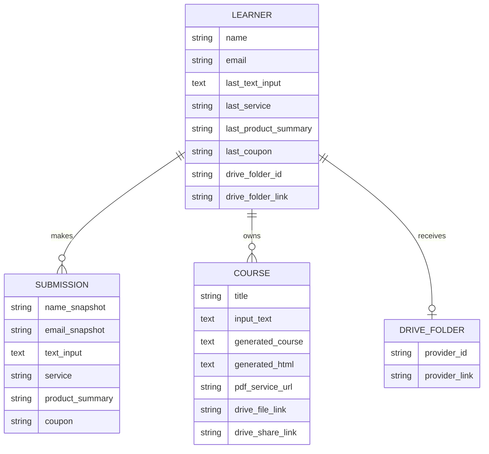
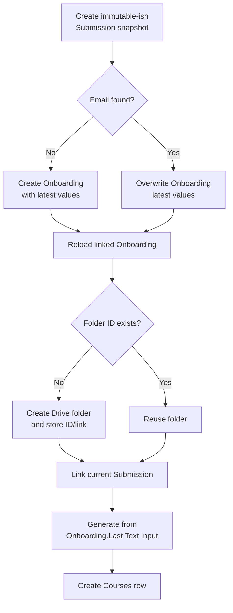

# Data and Integrations

This document reconstructs the legacy system’s data contracts and vendor
boundaries. It separates logical product data from deployment-specific IDs so
the current application can preserve the useful concepts without reproducing
the old infrastructure.

## Logical data model



`LEARNER` is represented by the Airtable table named `Onboarding`. The name
reflects the automation’s history; functionally it is a learner/customer
profile with denormalized “latest request” fields.

The diagram shows the intended relationships. The blueprints do not contain a
standalone learner ID, unique email constraint, database schema, or migration.

## Cross-scenario contracts

Both Make-to-Make calls use the same unversioned shape:

```json
{
  "clientID": "recExample123"
}
```

| Producer | Consumer | `clientID` meaning |
|---|---|---|
| Scenario 1 | Scenario 2 | Airtable `Submission` record ID |
| Scenario 2 | Scenario 3 | Airtable `Onboarding` record ID |

The payload lacks:

- a contract/schema version;
- resource type;
- event or job ID;
- idempotency key;
- timestamp/expiry;
- tenant or user identity;
- signature or authorization token;
- trace/correlation ID.

The only practical validation visible in the consumer is that Airtable can
retrieve a record with the supplied ID.

## Paperform intake contract

The Paperform event is mapped by opaque question IDs. The destination labels
provide the only committed description of those answers.

| Event path | Logical field | Storage behavior |
|---|---|---|
| `data.e23ki.value` | Name | Stored as received |
| `data.efnrp.value` | Email | Lowercased before storage |
| `data.e9mqr.value` | Source text/course request | Stored as `Text Input` |
| `data.9886n.value` | Service | Stored, but never used to branch generation |
| `charge.summary` | Product summary | Stored, but never used to authorize generation |
| `data.coupon.value` | Coupon | Stored, but never validated in Make |

There is no visible field-level validation, maximum input size, accepted
language, audience, desired level, learning goal, accessibility preference, or
consent field. Paperform may have enforced constraints outside the export, but
that is not provable here.

## Airtable base and tables

All Airtable modules target the same base, labeled `Study` in the export.
Exact object IDs are documented because they make the opaque record mappings
auditable; they are identifiers, not credentials.

### Submission (`tblfpQGzU39wlepZN`)

One row is created for every Paperform submission.

| Field | Airtable field ID | Written from | Later use |
|---|---|---|---|
| Name | `fldl195W4iE5OWOEX` | Paperform name | Copied to a new Onboarding row |
| Email | `fldW5fTQBzxWfcUXf` | Lowercased Paperform email | Onboarding lookup and creation |
| Text Input | `fldypL8Kz7kUbr3mw` | Paperform source text | Copied to Onboarding |
| Service | `fldN4zXiCsRf6SZBo` | Paperform service | Copied to Onboarding |
| Product Summary | `fldkMVixFWukhDrw5` | Paperform charge summary | Copied to Onboarding |
| Coupon | `fldCvydSPN56php1j` | Paperform coupon | Copied to Onboarding |
| Onboarding | `fld33m7RXQ19r9GRx` | Reverse/linked Airtable relationship | Used to reload the learner profile |

Submission preserves a request snapshot better than Onboarding, but Scenario 3
does not load it. Generation reads only the learner’s denormalized latest input.

### Onboarding (`tblHpU23PlR0sM1LF`)

The scenario searches the `Grid view` by exact lowercased email and requests at
most one record.

| Field | Airtable field ID | New learner | Returning learner | Use |
|---|---|---|---|---|
| Name | `fldN1drqZAmzVuqqP` | Set | Not updated | Folder/email personalization |
| Email | `fldo5jfkwRfqmKwJ7` | Set | Not updated | Identity lookup and delivery |
| Last Text Input | `fld0pPueup2oiZF8o` | Set | Replaced | Sole source for generation |
| Service | `fldf4DjMxKzJdqBng` | Set | Replaced | Stored only |
| Product Summary | `fldMMZE1AecOob3iX` | Set | Replaced | Stored only |
| Coupon | `fld4vCzmK5NAwP1Nb` | Set | Replaced | Stored only |
| Link Submission | `fldbEQi3Xukz1Qwjd` | Current Submission | Replaced with current Submission | Reload/linking |
| Courses | `fldESDtn1F81nVTTE` | Reverse relationship | Reverse relationship | Learner course history |
| Folder ID | `fldcxWTXU8bY3tKBB` | Set after folder creation | Reused | Drive destination |
| Folder Link | `fld83TL6WhXJhhtbM` | Set after folder creation | Reused | Delivery email |

One create-module metadata snapshot calls `fld0pPueup2oiZF8o` “Text Input,”
while update/read metadata calls it “Last Text Input.” The stable field ID
shows this is a rename, not two fields.

The search also requests Airtable-computed `Created Time` and `Record ID`
values. Neither drives a decision.

### Courses (`tblxxESTN947WDibJ`)

One row is created near the end of Scenario 3.

| Field | Airtable field ID | Source |
|---|---|---|
| Title | `fldrBH73WNpFhSRme` | Parsed OpenAI `file_name` |
| Input Text | `fld4kOyX6Ux0MWWxA` | Onboarding Last Text Input |
| Generated Course Material | `fldnVbKAEhkJXOpkv` | Claude course response |
| Generated HTML Code | `fldiBGx6viH6GxcgT` | OpenAI HTML response |
| Course URL | `fldxPFMbj6fAVqoBe` | PDF conversion service URL |
| Course PDF | `fld41VH92HmzQRJDR` | Airtable attachment referencing PDF service URL |
| GDrive Link | `fldQkBXkxzYJMzXM2` | Uploaded Drive file web-view link |
| GDrive Share Link | `flddCS4UzTnZ5no6n` | Anyone-with-link course share URL |
| Onboarding | `fldY7FA6N9lvNV2qs` | Link to learner row |

No Courses field stores:

- quiz document ID or URL;
- answer-key metadata;
- generation status or failure;
- source/citation data;
- model/provider versions;
- token/cost usage;
- timestamps beyond any Airtable-created field;
- content version or hash.

## Data mutation timeline



The handoff to Scenario 3 carries only the Onboarding ID. If another request
updates that row before Scenario 3 reads it, the earlier execution can generate
from the newer request. A robust replacement should bind each job to an
immutable input snapshot and hash.

## Google Drive layout and permissions

The configured logical layout is:

```text
fixed account-owned parent path/
└── Course Material - <learner name>/
    ├── <generated title>.pdf
    ├── Quiz - <generated title>   # converted Google Doc
    └── later courses and quizzes for the same email
```

The exact parent path contains two deployment-specific Drive folder IDs.
Scenario 2 writes each learner folder beneath that path. Scenario 3 repeats the
same fixed path plus the stored learner Folder ID when writing files.

Permissions are:

| Object | Configured access |
|---|---|
| Learner folder | Shared, `anyone`, `commenter` |
| Course PDF | `anyone`, `reader`, file discovery disabled |
| Quiz Google Doc | `anyone`, `reader`, file discovery disabled |

This is link-based public access, not authorization. The folder-level
commenter permission is especially broad and can expose later files placed in
the same folder, depending on inherited Google Drive permissions.

There is no configured expiration, revocation, retention, deletion, or owner
verification.

## External service boundaries

| Service | Data received | Data returned/stored | Replacement direction |
|---|---|---|---|
| Paperform | Learner identity, source text, commerce metadata | Submission event | React/FastAPI intake |
| Make.com | All event IDs and orchestration data | Workflow state/execution logs | Application services + durable jobs |
| Airtable | Identity, raw input, full generated course/HTML, URLs | Records/relationships | Owner-scoped SQLite/application persistence |
| Anthropic | Learner input and full course text | Course and quiz text | Existing OpenAI/Codex staged pipeline |
| OpenAI | Full generated course text | File name and HTML | Existing structured generation + deterministic naming/rendering |
| 0-CodeKit | Full generated HTML | Hosted/generated PDF URL | Existing deterministic PDF renderer |
| Google Drive | Learner name, full course/quiz, generated titles | Files, IDs, public links | Existing private artifact store; optional export |
| Gmail | Learner name/email and public links | Delivery message | Results UI first; idempotent notifier later |

The same full course is sent to three downstream model calls/services after it
is generated: file naming, HTML conversion, and quiz generation. The HTML is
then sent to the PDF service. This increases data exposure and cost.

## Data classification

| Classification | Legacy examples | Systems receiving it |
|---|---|---|
| Direct identity | Name, email | Paperform, Make, Airtable, Google/Gmail |
| Learner-supplied content | Course request or pasted transcript; potentially sensitive source material | Paperform, Make, Airtable, Anthropic |
| Generated learning content | Course text, HTML, PDF, quiz, answer key | Make, Anthropic and/or OpenAI, PDF service, Airtable, Google Drive |
| Commerce metadata | Service, product summary, coupon | Paperform, Make, Airtable |
| Operational metadata | Airtable record IDs, Drive IDs/links, provider file URLs | Make, Airtable, Google, PDF service |
| Invocation secrets/identifiers | Custom webhook URLs, connection IDs and labels | Blueprint export/repository |

The exports show no consent notice, processor disclosure, data-region policy,
retention period, subject-access workflow, deletion workflow, or rule
preventing sensitive/personal text from being submitted. The `eu2.make.com`
zone is configured, but that setting alone does not prove end-to-end data
residency because the other processors are separate systems.

## Deployment-specific configuration in the exports

The JSON contains:

- Make webhook IDs and two live-looking webhook URLs;
- Make connection IDs for Airtable, Anthropic, OpenAI, PDF conversion, and
  Google;
- Airtable base/table/view/field IDs;
- fixed Google Drive parent-folder IDs;
- connection labels containing an Airtable user ID and an operator email;
- model identifiers and prompt text;
- the delivery brand name used in email.

The JSON does not show a non-empty password, API key, bearer token, OAuth
access token, or refresh token. That does **not** make the exports safe to
activate: possession of a custom webhook URL may be sufficient to invoke a
scenario.

## Restoration checklist

If the historical workflow ever needs to be run for forensic comparison, use
an isolated test workspace and:

1. Rotate or recreate both custom webhooks and the Paperform hook.
2. Create fresh least-privilege connections; never reuse the labels/IDs as
   credentials.
3. Recreate all three Airtable tables and verify linked-field direction.
4. Add an actual unique constraint or guarded upsert for normalized email.
5. Replace the fixed Drive parent with a test-only private folder.
6. Remove `anyone` folder/file permissions.
7. Confirm each model ID and connector module version is still supported.
8. Cap input/output size and provider spend.
9. Add a synthetic request ID, idempotency key, signature, and status record.
10. Use non-sensitive sample data only.
11. Test the zero-result Airtable search branch and both routers.
12. Test every failure boundary before allowing any external submission.

This checklist is for controlled reconstruction, not a recommendation to use
the Make implementation in the submission.

## Canonical migration mapping

| Legacy record/concept | Current canonical owner |
|---|---|
| Paperform submission | FastAPI request + normalized `InputDocument` |
| Email-based Onboarding | Authenticated application user/profile |
| Last Text Input | Immutable job input hash and normalized input snapshot |
| Make `clientID` handoff | Versioned job ID scoped to its owner |
| Courses row | Durable generation job + canonical artifacts |
| Airtable link fields | Explicit foreign keys/owner checks |
| Folder ID/link | Private artifact-store namespace |
| Course/quiz public links | Authorized artifact download endpoints |
| Make execution state | `JobStatus`, checkpoints, budgets, and outbox |
| Gmail terminal action | Idempotent notification after committed delivery |

The current library already contains most of the right-hand-side contracts.
The application shell should expose them rather than create a second workflow
database.
