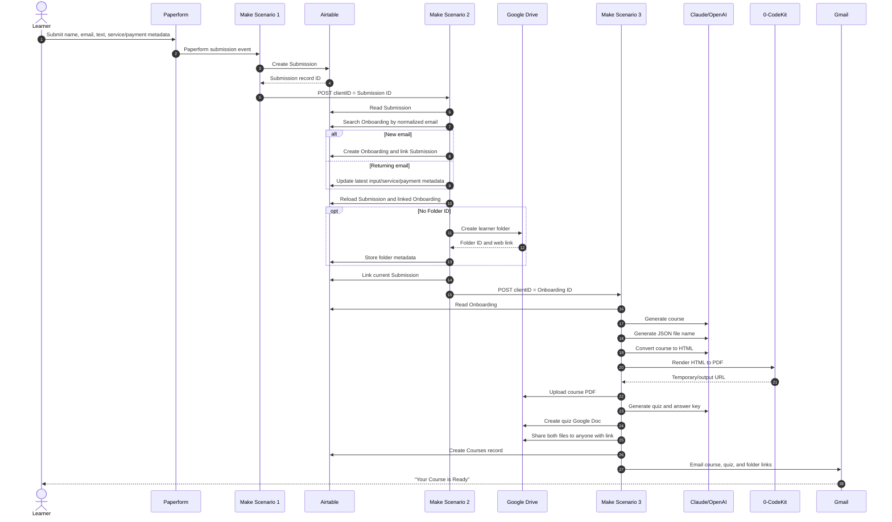

# Legacy System Reference

This is a module-complete reconstruction of the exported Make.com “Text to
Course” workflow. It follows the successful path, the conditional branches,
and the configured error behavior without assuming that the connected services
still exist.

## How to read the evidence

Statements in this reference use three confidence levels:

- **Configured:** directly present in a blueprint mapping, filter, prompt, or
  scenario setting.
- **Derived:** follows mechanically from multiple configured mappings.
- **Inferred:** likely business intent, but not provable from the exports
  alone.

Module IDs are local to each scenario. For example, module `26` exists in all
three scenarios and means something different in each.

## System inventory

| Category | Configured inventory |
|---|---|
| Make scenarios | 3 instant scenarios in the `eu2.make.com` zone |
| Total modules | 33: 31 workflow modules plus 2 error-handler modules |
| Triggers | 1 Paperform submission trigger and 2 custom webhooks |
| Data operations | 11 Airtable operations across 3 tables |
| Branching | 2 routers, both in Scenario 2 |
| Model calls | 4: 2 Anthropic Claude and 2 OpenAI chat completions |
| Document/storage operations | 5 Google Drive operations and 1 PDF conversion |
| Delivery | 1 Gmail send operation |
| Explicit module retries | 2 Break error handlers, attached only to the OpenAI file-name and HTML calls |

### Operations by connector

| Connector/module family | Exported module version | Count | Responsibility |
|---|---:|---:|---|
| Airtable | 3 | 11 | Submission, learner, folder, and course state |
| Google Drive | 4 | 5 | Folder creation, file creation/upload, and link sharing |
| HTTP | 3 | 3 | Two scenario handoffs and one PDF download |
| Anthropic Claude | 1 | 2 | Course writing and quiz writing |
| OpenAI | 1 | 2 | File naming and HTML conversion |
| Make custom webhook | 1 | 2 | Start Scenarios 2 and 3 |
| Make router | 1 | 2 | New/returning learner and folder routing |
| Make Break error handler | 1 | 2 | Automatic retries for two OpenAI calls |
| Paperform | 1 | 1 | Original form event |
| Set Variables | 1 | 1 | Course and HTML prompts |
| 0-CodeKit/OneSAAS PDF | 2 | 1 | HTML-to-PDF conversion |
| Gmail | 2 | 1 | Link-delivery email |

## End-to-end sequence



The two HTTP handoffs contain only a `clientID` string. The first ID names a
Submission record; the second names an Onboarding record. The meaning changes
without a version or resource-type field.

## Scenario 1: form intake

**Blueprint:** [Part 1](<[STUDY] Create Course Material from Plain Text (1-3).blueprint.json>)

**Configured purpose:** turn one Paperform event into a Submission record and
start onboarding.

| Order | Module | Configured behavior |
|---:|---|---|
| 1 | `23` — `paperform:submission` | Instant trigger bound to the Paperform webhook labeled `Text to Course` |
| 2 | `27` — `airtable:ActionCreateRecord` | Create a record in the `Study` base’s `Submission` table; normalize email to lowercase |
| 3 | `26` — `http:ActionSendData` | POST JSON to the next Make webhook with the new Airtable record ID as `clientID` |

The form-to-Airtable mapping is:

| Paperform source | Submission destination | Transformation |
|---|---|---|
| `data.e23ki.value` | Name | None |
| `data.efnrp.value` | Email | Lowercase |
| `data.e9mqr.value` | Text Input | None |
| `data.9886n.value` | Service | None |
| `charge.summary` | Product Summary | None |
| `data.coupon.value` | Coupon | None |

The opaque Paperform question keys are not self-describing. Their meanings are
derived from the named Airtable destinations.

### Scenario 1 handoff

```json
{
  "clientID": "<Airtable Submission record ID>"
}
```

The request uses JSON over HTTPS, follows redirects, validates the remote TLS
certificate, and treats non-2xx/3xx states as errors. It has no configured
authorization header, signature, timestamp, event ID, or idempotency key.

## Scenario 2: onboarding and folder routing

**Blueprint:** [Part 2](<[STUDY] Create Course Material from Plain Text (2-3).blueprint.json>)

**Configured purpose:** consolidate requests by email, keep the latest request
on the learner record, ensure a Drive folder exists, then start generation.

### Common prefix

| Order | Module | Configured behavior |
|---:|---|---|
| 1 | `26` — `gateway:CustomWebHook` | Receive one `clientID`; webhook label is `Text to Course - Onboarding` |
| 2 | `27` — `airtable:ActionGetRecord` | Read the corresponding Submission |
| 3 | `28` — `airtable:ActionSearchRecords` | Search the `Onboarding` table for `Email = lower(Submission.Email)`; request at most one record |
| 4 | `29` — `builtin:BasicRouter` | Run the new-client, returning-client, and continuation routes |

### Outer router

| Route | Filter | Modules | Result |
|---|---|---|---|
| New client | Search length equals `0` | `30` — create Onboarding | Copies name, email, input, service, product summary, coupon, and a link to the Submission |
| Returning client | Search length is greater than `0` | `32` — update Onboarding | Replaces the last input, service, product summary, coupon, and linked Submission |
| Continue | Unfiltered | `34` — reload Submission; `35` — reload Onboarding; `37` — inner router | Resolves the linked Onboarding after either write, then handles the folder and generation handoff |

The return path does not update the stored Name or Email. Email is functioning
as the lookup key, not a verified identity. The export requests only one search
result, so duplicate Onboarding records would be hidden rather than reconciled.

The new-client branch assumes the Airtable search module emits a bundle whose
`__IMTLENGTH__` can equal zero. Whether that remains true after importing into
a newer connector version must be tested; if a zero-result search emits no
bundle, the downstream router cannot run.

### Inner router

| Route | Filter | Modules | Result |
|---|---|---|---|
| Create folder | `Folder ID` does not exist | `38` — create Drive folder; `39` — store folder ID/link and current Submission link | Creates `Course Material - <Name>` below a fixed Drive parent and stores its metadata |
| Continue | Unfiltered | `36` — update current Submission link; `33` — HTTP POST | Starts Scenario 3 with the Onboarding record ID |

The folder is configured as shared with `type = anyone` and
`role = commenter`. That is broader than the later per-file reader links.

### Scenario 2 handoff

```json
{
  "clientID": "<Airtable Onboarding record ID>"
}
```

The handoff has the same unsigned, unversioned shape and HTTP settings as the
first handoff.

### Concurrency and identity implications

The scenario metadata sets `sequential` to `false`. Combined with a
search-then-create flow and no database uniqueness constraint visible in the
export, two requests for the same new email could race and create duplicates.
Assigning the linked-Submission array also appears intended to make the current
request the “last” request; it is not a reliable immutable request history.

## Scenario 3: generation, persistence, and delivery

**Blueprint:** [Part 3](<[STUDY] Create Course Material from Plain Text (3-3).blueprint.json>)

**Configured purpose:** generate all learning content, render/store it, create
public links, record the course, and notify the learner.

| Order | Module | Input → output |
|---:|---|---|
| 1 | `26` — custom webhook, `From Onboarding` | `clientID` → execution |
| 2 | `27` — Airtable `Onboarding: Retrieve` | Onboarding ID → learner/latest-input record |
| 3 | `4` — `SetVariables` | Static course prompt, `MAX_TOKENS = 64000`, and static HTML prompt |
| 4 | `35` — Claude `Create Course` | Latest text input + course prompt → course text |
| 5 | `11` — OpenAI `File Naming` | Full course text → parsed JSON `{ "file_name": "..." }` |
| 6 | `31` — OpenAI `Create HTML` | Full course text + HTML prompt → standalone HTML |
| 7 | `9` — 0-CodeKit `Convert HTML to PDF` | HTML + 50-unit margins → PDF URL |
| 8 | `12` — HTTP `Download Course PDF` | PDF URL → binary bytes |
| 9 | `10` — Drive `Save Course to GDrive` | PDF bytes → `<file_name>.pdf` in learner folder |
| 10 | `33` — Claude `Create Quiz Questions` | Full course text → 5–10 short-answer questions and answers |
| 11 | `32` — Drive `Create GDoc Quiz` | Quiz text → converted Google Doc named `Quiz - <file_name>` |
| 12 | `28` — Drive `Create Share Link for Course` | Course file → anyone-with-link reader URL |
| 13 | `34` — Drive `Create Share Link for Quiz` | Quiz file → anyone-with-link reader URL |
| 14 | `29` — Airtable `Course: Create Record` | Input, generated forms, file URLs, and Onboarding link → Courses row |
| 15 | `30` — Gmail `Send Course` | Name/email + course/quiz/folder links → HTML completion email |

Two more modules live under error handlers rather than on the success path:

| Parent module | Error-handler module | Configured policy |
|---|---|---|
| `11` — File Naming | `36` — `builtin:Break` | Automatically retry, count `5`, interval `3` |
| `31` — Create HTML | `37` — `builtin:Break` | Automatically retry, count `5`, interval `3` |

No equivalent handler is attached to course generation, PDF conversion,
download/upload, quiz generation, sharing, Airtable persistence, or email.

## Generated outputs and where they go

| Output | Format | Persistence | Visibility on success |
|---|---|---|---|
| Course source | Model-generated text | Airtable `Courses.Generated Course Material` | Not directly emailed |
| Course HTML | Model-generated HTML | Airtable `Courses.Generated HTML Code` | Not directly emailed |
| Course PDF | PDF service output, then Drive upload | Google Drive and Airtable URL/attachment fields | Anyone-with-link course button in email |
| Quiz + answer key | Plain text converted to Google Doc | Google Drive | Anyone-with-link quiz button in email |
| Learner folder | Google Drive folder | Folder ID/link on Onboarding | Folder button in email |
| Course catalog row | Airtable record | `Courses` table | Internal only |
| Completion message | HTML email | Gmail/provider mail history | Sent to Onboarding Email |

The Airtable Courses row does not store the quiz file ID or share link. The
quiz remains discoverable through the Drive folder and the one delivery email.

The Airtable attachment filename uses `{{11.result}}.pdf`, while the Drive
upload correctly uses `{{11.result.file_name}}.pdf`. Because `result` is the
parsed JSON object, the attachment name mapping is likely malformed or at
least inconsistent.

### Delivery email contract

The terminal Gmail module sends:

- subject `Your Course - <generated file name>`;
- heading `Your Course is Ready! "<generated file name>"`;
- a greeting using the stored Onboarding Name;
- separate `View/Download Course` and `View/Download Quiz` buttons;
- a `Your Courses Folder` button;
- a support invitation to reply;
- the signature `The AI with Apex Team`.

It sends links only—there are no attachments, CC, or BCC recipients. The
configured `from` value is blank, so the connected Gmail account supplies the
sender identity.

## Execution settings

All three exports are configured as instant scenarios with:

- schema/export version `1`;
- one roundtrip;
- maximum errors `3`;
- automatic commit enabled;
- automatic trigger-last commit enabled;
- non-sequential execution;
- confidential mode disabled;
- data-loss mode disabled;
- fresh variables disabled;
- no fixed slot count.

Dead-letter-queue metadata is disabled in Scenarios 1 and 2 and enabled in
Scenario 3. The export does not show any operator alert, replay procedure,
dashboard, correlation ID, or learner-visible failure state.

## Success and failure boundaries

### What constitutes success

There is no explicit status field or completion transaction. Success is
implicitly “module 30 sent the Gmail message.” Before that terminal action,
the system may already have:

- generated and paid for model output;
- created public Drive files;
- written a Courses row;
- failed to tell the learner.

Conversely, an email retry or manual replay could send duplicates because no
idempotent notification key is present.

### Partial-state examples

| Failure point | State likely left behind |
|---|---|
| Scenario 1 handoff fails | Submission exists, but onboarding never starts |
| Folder metadata write fails | Drive folder may exist without an Airtable Folder ID, allowing duplicate folders on replay |
| Course upload fails | Course text and HTML exist only inside the execution; PDF service may already hold an output |
| Quiz generation fails | Course PDF exists in Drive, but no quiz or Courses row |
| Course record write fails | Public files exist, but catalog/history lacks the course |
| Gmail send fails | Public files and Courses row exist, but learner receives no completion message |

## What the legacy system does not contain

No module or mapping provides:

- web research, source ranking, citations, or claim support;
- file/URL/media ingestion;
- a separate course plan or human approval checkpoint;
- a standalone review pack, glossary artifact, flashcards, or study schedule;
- a student-only assessment separate from its answer key;
- question blueprints, points, rubrics, or grading;
- authenticated learner access or authorization checks;
- content moderation, consent, age handling, or high-risk-topic review;
- HTML sanitization, prompt-injection defenses, or output schema validation
  beyond the file-name JSON response;
- job progress, cancellation, durable checkpoints, or exact resume;
- spend quotas, token accounting, retention, deletion, or audit events;
- deterministic rendering tests or educational quality evaluations.

These absences are not criticisms of a small automation prototype. They are
the clearest evidence for what the production-shaped hackathon submission
must add or deliberately defer.

## Complete module coverage checklist

This table is a compact audit that every exported module appears above.

| Scenario | Success-path/router module IDs | Error-handler IDs | Count |
|---|---|---|---:|
| 1 | `23, 27, 26` | — | 3 |
| 2 | `26, 27, 28, 29, 30, 32, 34, 35, 37, 38, 39, 36, 33` | — | 13 |
| 3 | `26, 27, 4, 35, 11, 31, 9, 12, 10, 33, 32, 28, 34, 29, 30` | `36, 37` | 17 |
| **Total** | 31 modules | 2 modules | **33** |
