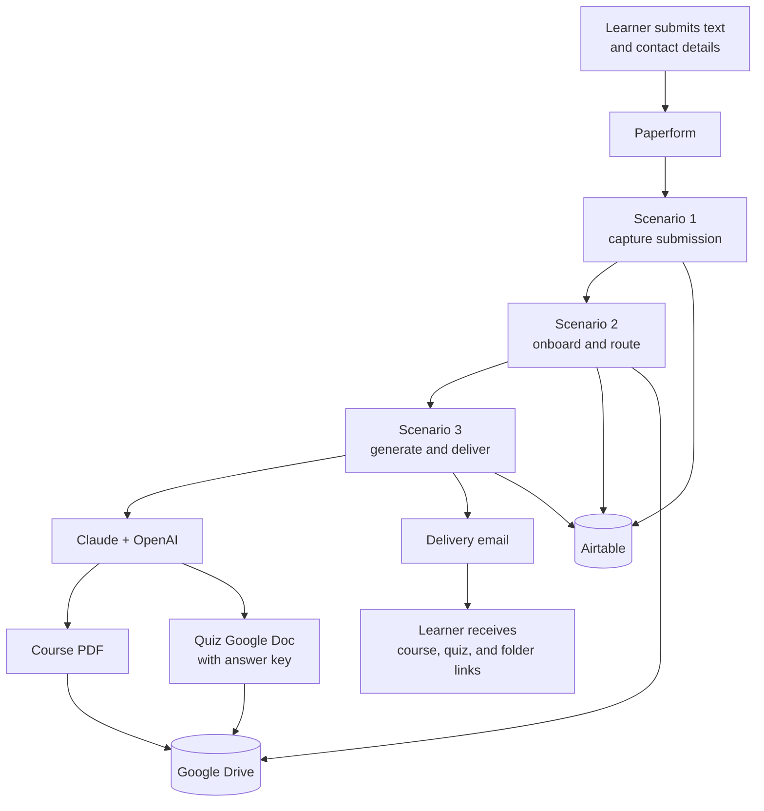

# Legacy Make.com “Text to Course” System

This directory preserves the three Make.com blueprints that implemented the
original “text to course” proof of concept. Together they accepted a
Paperform submission, maintained lightweight customer state in Airtable,
generated course material and a quiz with AI models, rendered the course as a
PDF, stored the results in Google Drive, and emailed links to the requester.

The blueprints are historical product evidence. They are not the architecture
recommended for the current txt2crs application.

## Start here

The documentation is split by the question it answers:

| Document | Use it to understand |
|---|---|
| [Legacy system reference](LEGACY_SYSTEM_REFERENCE.md) | The complete user journey, all 33 modules, router behavior, outputs, retries, and execution settings |
| [Data and integrations](DATA_AND_INTEGRATIONS.md) | Webhook contracts, Paperform mappings, Airtable tables and relationships, Google Drive layout, vendors, and sensitive configuration |
| [Generation pipeline](GENERATION_PIPELINE.md) | The four model calls, prompt requirements, pedagogical behavior, output transformations, and quality limitations |
| [Feature and submission plan](FEATURE_AND_SUBMISSION_PLAN.md) | What to preserve, improve, defer, or reject; what the Python engine already supplies; and what the application still needs for the hackathon |

## Executive summary

The legacy product had three useful ideas at its center:

1. Make the learner’s input the seed of a structured course.
2. Remember a returning learner and keep their outputs together.
3. Deliver a finished learning package rather than stopping at model text.

Its successful path was:

The exported system is a plain-text pipeline, despite prompt language that
also mentions video transcripts. It does not ingest files, URLs, audio, video,
or YouTube directly. It asks a model to make content accurate and current, but
it performs no research, source collection, citation verification, or
deterministic factual validation.

The deliverables are also narrower than the present txt2crs goal:

- one course PDF;
- one Google Doc containing both a 5–10 question short-answer quiz and its
  answer key;
- no standalone comprehensive review pack;
- no student-only test separated from the instructor answer sheet.

Those distinctions matter: the old system is an influence and a feature-discovery
artifact, not a parity specification.

## Blueprint manifest

The checksums below identify the exact source snapshot used for this
reconstruction. Module counts include nested router branches and error-handler
modules.

| Blueprint | Make scenario name | Role | Modules | SHA-256 |
|---|---|---|---:|---|
| [Part 1 blueprint](<[STUDY] Create Course Material from Plain Text (1-3).blueprint.json>) | `[STUDY] Create Course Material from Plain Text (1/3)` | Form intake and Submission record | 3 | `5087d2cacbf2cc5d00e148dd66c5eb6a2d13b286d49b049ac13da363d85262e7` |
| [Part 2 blueprint](<[STUDY] Create Course Material from Plain Text (2-3).blueprint.json>) | `[STUDY] Create Course Material from Plain Text (2/3)` | Returning-user state and Drive folder | 13 | `ac8593a66bff2f6b72dcf140bc244d5853204dd0daf8df239fdef1b4045395f1` |
| [Part 3 blueprint](<[STUDY] Create Course Material from Plain Text (3-3).blueprint.json>) | `[STUDY] Create Course Material from Plain Text (3/3)` | Course/quiz generation, storage, and email | 17 | `0a49dfdacb7c3481647c896ce9e473f28eecf9868fa60a6106847ff39d2c65f0` |

The exports have no embedded Make notes. Scenario names, module names,
module mappings, filters, prompt text, and metadata are therefore the primary
evidence. Where the documentation infers business intent rather than reading
it directly from a mapping, it says so.

## Product decisions at a glance

| Legacy concept | Current decision |
|---|---|
| Accept pasted source text | Preserve and expand to every input type already supported by the Python library |
| Infer beginner/intermediate/advanced level | Preserve as a fallback; also let the learner choose or confirm the level |
| Reuse a learner folder and course history | Preserve the library/history experience, but key it by an authenticated owner rather than email |
| Store commerce fields from Paperform | Defer payments, products, and coupons until the learning workflow is submission-ready |
| Generate the entire course in one model response | Replace with the existing planned, module-sized, checkpointed generation pipeline |
| Ask the model to be current | Replace with the existing research, evidence, and citation pipeline |
| Use a model to rewrite course text into HTML | Replace with the existing deterministic renderers |
| Produce a quiz and answer key in one learner-visible file | Split into the existing student assessment and instructor answer key |
| Put results in anyone-with-link Drive files | Default to authenticated, owner-scoped artifact downloads; make Drive export optional |
| Send an email as the only completion experience | Make the results page primary; add idempotent email as a later delivery channel |
| Use Airtable as workflow state | Use the existing durable SQLite job/checkpoint layer behind FastAPI |
| Chain public Make webhooks | Use versioned, authenticated application routes and an explicit job state machine |

The detailed prioritization and acceptance criteria are in
[FEATURE_AND_SUBMISSION_PLAN.md](FEATURE_AND_SUBMISSION_PLAN.md).

## Relationship to the current repository

The reusable Python engine already implements the difficult education work:
multi-format ingestion, bounded research, evidence-backed course generation,
a review pack, a student assessment, a separate answer key, deterministic
HTML/Markdown/PDF/DOCX rendering, durable resume, private storage, and
evaluation. See the
[package overview](../backend/packages/txt2crs/README_txt2crs.md) and
[implementation compliance matrix](../backend/packages/txt2crs/docs/IMPLEMENTATION_COMPLIANCE.md).

The main remaining submission work is the application shell: FastAPI
composition and routes, a beautiful browser interface, owner/session
establishment, progress and error UX, safe artifact downloads, and a polished
demo path. Rebuilding Make.com, Airtable, or the old model-to-HTML chain would
duplicate weaker versions of capabilities that now exist in the library.

## Security and restoration notice

The blueprint exports contain deployment-specific identifiers, account labels,
an operator email address, Airtable and Google Drive object IDs, and
live-looking Make webhook URLs. They do not contain an obvious non-empty API
key or password, but webhook URLs can act as bearer secrets.

- Do not assume any exported endpoint is inactive.
- Rotate or delete the legacy webhooks before making the repository public.
- Do not import and activate these blueprints unchanged.
- Rebind every connection and destination in a controlled environment.
- Keep the JSON files as historical evidence; do not use them as production
  configuration.

The full portability and data-exposure review is in
[DATA_AND_INTEGRATIONS.md](DATA_AND_INTEGRATIONS.md).

## Provenance limits

This documentation describes the last exported configuration committed here.
It cannot prove:

- the date the original system first ran;
- whether the exports were edited after the first prototype;
- whether all connected Airtable fields, Google files, or Paperform questions
  still exist;
- whether the scenarios completed successfully in production;
- whether the model identifiers and external connections remain available.

Any claim about runtime data, historical volume, learner outcomes, or current
vendor behavior requires evidence outside these three blueprints.
